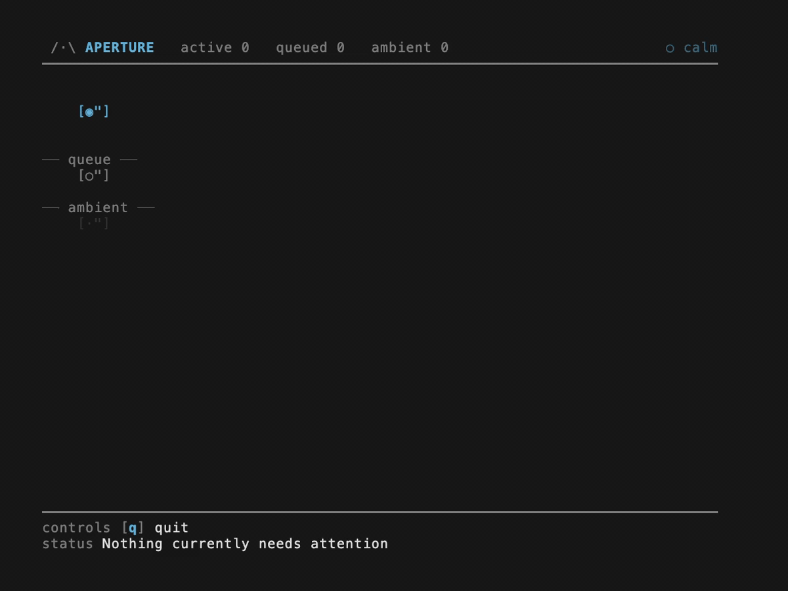

<div align="center">

# Aperture

**The human attention control plane for agent systems.**



<p></p>
</div>


Aperture sits between many possible event sources and one human decision surface, then decides what deserves attention now, what should wait, and what should remain ambient.

**Live path today:** Claude Code (multiple agents) → Aperture runtime → terminal attention surface

## Start Here

Choose one path:

- use the published SDK if you want to embed Aperture's judgment engine in your own runtime or UI
- run the full local stack if you want the working Claude Code + runtime + TUI experience on this machine

### Use The Published SDK

**npm package:** `@tomismeta/aperture-core`

```bash
npm install @tomismeta/aperture-core
```

See the full SDK docs in [packages/core/README.md](/Users/tom/dev/aperture/packages/core/README.md).

### Run The Full Local Stack

```bash
git clone git@github.com:tomismeta/aperture.git
cd aperture
pnpm install
pnpm claude:connect --global
pnpm aperture
```

This starts the current live path:

- Claude Code adapter
- Aperture runtime
- terminal attention surface

Under the hood, Aperture already includes:

- deterministic policy, attention value, and planning layers
- behavioral signals and memory-backed judgment
- scaffolded local judgment control for bounded approvals and interrupt rules
- episode-aware coordination across related work
- attention pressure forecasting before overload
- replay evaluation for judgment behavior

## What Aperture Is

Aperture is an engine-first TypeScript workspace for allocating and protecting human attention in agent-heavy workflows.

It is not:

- an orchestrator
- a chat UI
- a dashboard
- a generic queue
- an LLM call wrapped around approval prompts

The core bet is simple:

**human attention should be allocated by a fast, deterministic, inspectable engine that gets better with use**

Today, that includes a live local judgment surface: Aperture scaffolds `.aperture/JUDGMENT.md`, loads it on startup, and uses it to control bounded auto-approval, interruption policy, and planner defaults.

## Why It Exists

When you supervise multiple agents, everything can interrupt at once:

- tool approvals
- failures
- blocked work
- follow-up questions
- status noise

The hard problem is not moving events around.

The hard problem is deciding how human attention should be spent.

Aperture exists to answer that in the hot path, without turning every judgment into a slow or expensive model call.

## Current Product Shape

What is real on `main` today:

- the Aperture core SDK (`@tomismeta/aperture-core`) is the judgment engine
- `@aperture/runtime` hosts one live shared core for adapters and surfaces
- `@aperture/tui` is the terminal-native attention surface
- `@aperture/claude-code` is the current end-to-end live adapter path
- `@aperture/codex` and `@aperture/paperclip` provide mapping layers today, with different transport maturity
- the Aperture core SDK now exposes the main judgment primitives for future SDK use
- the default runtime uses local learning persistence through `.aperture/MEMORY.md` and a scaffolded `.aperture/JUDGMENT.md`
- `USER.md`, `MEMORY.md`, and `JUDGMENT.md` remain the broader core judgment-state model, even though `MEMORY.md` and `JUDGMENT.md` are the live default local surfaces today

What the engine already does:

- normalize source events into one shared attention model
- separate hard policy from adaptive utility and queue planning
- learn from response latency, context expansion, deferral, and disagreement
- keep related work continuous through episode modeling
- suppress lower-value work before overload
- explain decisions through score components, planner rationale, and replay traces

## Quickstart

This is the recommended path if you want Aperture managing Claude Code on this machine.

```bash
git clone git@github.com:tomismeta/aperture.git
cd aperture
pnpm install
pnpm claude:connect --global
pnpm aperture
```

Then:

1. restart Claude Code
2. run `/hooks` once inside Claude Code
3. use Claude normally

That starts the default local Aperture stack:

- shared runtime
- Claude Code adapter
- terminal attention surface
- local learning persistence in `.aperture/MEMORY.md`
- scaffolded local judgment defaults in `.aperture/JUDGMENT.md`

Use `pnpm aperture --learning off` if you want an ephemeral session with no local learning persistence.

`JUDGMENT.md` is a small human-owned config template. The accepted live values today are:

- rule names: `lowRiskRead`, `lowRiskWeb`, `fileWrite`, `envWrite`, `destructiveBash`
- rule fields: `auto approve`, `may interrupt`, `minimum presentation`, `require context expansion`
- planner defaults: `batch status bursts`, `defer low value during pressure`

If a category still requires a human response to proceed, keep it `active`. Use `auto approve` only for bounded approval categories you want Aperture to resolve immediately and deterministically.

In the default scaffold:

- `lowRiskRead`, `lowRiskWeb`, and `fileWrite` stay active for explicit human approval
- `envWrite` and `destructiveBash` stay active and require context expansion
- ratchet categories down to `auto approve` only when you explicitly want bounded pass-through

## Two Ways To Use It

### 1. Run Aperture With Claude Code

Use the shared runtime, Claude adapter, and TUI when you want a working local attention surface for live approvals, failures, and follow-up handoff.

This is the main product path today.

### 2. Embed The Aperture Core SDK

Use the core engine directly when you already control the event source and want attention judgment inside your own app or service.

Install it from npm as `@tomismeta/aperture-core`:

```bash
npm install @tomismeta/aperture-core
```

The recommended SDK loop is:

- publish an `ApertureEvent`
- get back an `AttentionFrame` if it should enter the human attention surface
- render that frame in your UI or workflow layer
- submit the human answer back into Aperture

In other words:

`event in -> frame out -> human answer in -> state updates`

Start with `ApertureEvent` for most integrations. Use `SourceEvent` only when you are building an adapter from source-native events and want Aperture to normalize them first.

For the full package-facing SDK docs, see [packages/core/README.md](/Users/tom/dev/aperture/packages/core/README.md).

## Architecture

- Aperture core SDK (`@tomismeta/aperture-core`): deterministic judgment engine
- `@aperture/runtime`: shared local host for one live `ApertureCore`
- `@aperture/claude-code`, `@aperture/codex`, `@aperture/paperclip`: source adapters
- `@aperture/tui`: source-agnostic terminal surface

The flow is:

`raw source payload → SourceEvent → core judgment → attention surface → human response → new signals`

## Using Core Directly

The Aperture core SDK is now published on npm as `@tomismeta/aperture-core` for embeddable judgment use.

If you already own the event stream, start with `ApertureEvent` and `core.publish(...)`:

```ts
import { ApertureCore } from "@tomismeta/aperture-core";

const core = new ApertureCore();

core.publish({
  id: "evt:approval",
  taskId: "task:deploy",
  timestamp: new Date().toISOString(),
  type: "human.input.requested",
  interactionId: "interaction:deploy:review",
  title: "Approve production deploy",
  summary: "A production deploy is waiting for review.",
  request: { kind: "approval" },
});

console.log(core.getAttentionView());
```

If your integration is building an adapter from source-native facts, publish `SourceEvent` instead:

```ts
import { ApertureCore } from "@tomismeta/aperture-core";
import { mapPaperclipLiveEvent } from "@aperture/paperclip";

const core = new ApertureCore();

for (const event of mapPaperclipLiveEvent(liveEvent)) {
  core.publishSourceEvent(event);
}
```

## Commands

### Day-to-day

| Command | What it does |
| --- | --- |
| `pnpm aperture` | Starts the default local Aperture stack: runtime, Claude adapter, TUI, local learning persistence in `.aperture/MEMORY.md`, and scaffolded judgment config in `.aperture/JUDGMENT.md`. |
| `pnpm aperture --learning off` | Starts the default local stack without local learning persistence. |
| `pnpm claude:connect --global` | Connects Claude Code globally by writing Aperture hook config into `~/.claude/settings.json`. |
| `pnpm claude:disconnect --global` | Removes Aperture's Claude hook entries from `~/.claude/settings.json`. |

### Manual / advanced

| Command | What it does |
| --- | --- |
| `pnpm serve` | Starts the shared Aperture runtime only. |
| `pnpm tui` | Starts the terminal UI and attaches it to a live runtime. |
| `pnpm claude:start` | Starts the Claude Code adapter separately from the default stack. |
| `pnpm claude:connect /path/to/project` | Connects Claude Code only for one project via `.claude/settings.local.json`. |
| `pnpm claude:disconnect /path/to/project` | Removes the project-local Claude hook config. |

### Development

| Command | What it does |
| --- | --- |
| `pnpm test` | Runs the full test suite. |
| `pnpm typecheck` | Runs TypeScript project checks. |
| `pnpm build` | Builds the TypeScript packages. |
| `pnpm demo:tui` | Runs the standalone demo renderer with sample data. |
| `pnpm clean` | Removes built package output. |

## What Is Built Today

- deterministic judgment with inspectable policy, utility, and planner outputs
- behavioral signals, trend summaries, and durable markdown-backed judgment state
- consequence calibration and human-specific memory
- episode batching, merge heuristics, and actionability
- predictive pressure handling
- replay evaluation foundation
- shared local runtime and source-agnostic TUI
- live Claude Code integration

## What Is Not Mature Yet

- live transports beyond Claude Code
- evaluator-driven tuning loops
- stale episode lifecycle
- richer anticipation behavior
- advisory model-based reasoning

## Reading The TUI

The TUI has three sections:

- **ACTIVE NOW**: the one thing Aperture thinks the human should look at first
- **QUEUE**: important items waiting behind the active frame
- **AMBIENT**: awareness-only items that should not interrupt

For the full guide, see [How to Read the TUI](docs/tui.md#how-to-read-the-tui).

## Docs

Start here:

- [Components](docs/components.md)
- [Engine Roadmap](docs/engine-roadmap.md)
- [TUI Surface](docs/tui.md)
- [Claude Code Adapter](docs/claude-code.md)

Reference docs:

- [Semantic Normalization](docs/semantic-normalization.md)
- [Interaction Signals](docs/interaction-signals.md)
- [Codex Adapter](docs/codex.md)
- [Paperclip Adapter](docs/paperclip.md)
- [Frame](docs/frame.md)

## Feedback

Helpful feedback right now:

- traces where the engine made the wrong call
- reports from real multi-agent supervision workflows
- examples of missing anticipation behavior
- tighter ingress/egress paths for existing adapters
