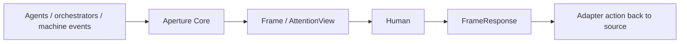

# Aperture

Aperture is the human attention engine for agent systems.

LLMs spend model tokens. Operators spend attention tokens.

A small TypeScript library that decides what deserves human attention now, what should wait, and what can remain ambient.

It is not:

- an orchestrator
- a protocol
- a renderer
- a dashboard

## Why

If you are supervising multiple agents, everything can interrupt at once:

- approvals
- failures
- blocked work
- status noise

Most agent software can emit events. Very little of it is good at spending human attention.

That is the wedge:

- not emitting more events
- not rendering more dashboards
- deciding which events are worth spending human attention on at all

Aperture exists to answer three questions:

- what deserves attention now
- what should queue behind it
- what should stay ambient



The first cut is small:

- Standalone library: `@aperture/core`
- Optional adapters: `@aperture/claude-code`, `@aperture/paperclip`, `@aperture/codex`, `@aperture/cli`
- Demo apps: `@aperture/attention-lab`, `@aperture/demo-cli`

`@aperture/core` stands on its own.

If you already control your event source, publish native `ApertureEvent`s directly into core.

Use an adapter only when you want Aperture to translate to and from an external system like Paperclip or Codex.

## Quickstart

Install dependencies and run the checks:

```bash
pnpm install
pnpm test
pnpm typecheck
```

Run the synthetic Claude Code hook demo:

```bash
pnpm demo:claude-code
```

Run the smallest end-to-end Paperclip transport loop:

```bash
pnpm demo:paperclip-mock-live
```

Run the mixed-source terminal demo:

```bash
pnpm demo:mixed
```

Open the browser replay harness:

```bash
pnpm demo:lab
```

Run any demo with trace output:

```bash
APERTURE_TRACE=1 pnpm demo:mixed
```

Connect to a real Paperclip stream:

```bash
PAPERCLIP_BASE_URL=http://localhost:3000 \
PAPERCLIP_COMPANY_ID=company-id \
PAPERCLIP_AUTH_TOKEN=token \
pnpm demo:paperclip-live
```

## Minimal Loop

Use core directly when you already control the event source:

```ts
import { ApertureCore, type ApertureEvent } from "@aperture/core";

const core = new ApertureCore();

const event: ApertureEvent = {
  id: "evt:approval",
  taskId: "task:deploy",
  timestamp: new Date().toISOString(),
  type: "human.input.requested",
  interactionId: "interaction:deploy:review",
  title: "Approve production deploy",
  summary: "A production deploy is waiting for review.",
  request: { kind: "approval" },
};

core.publish(event);

core.onResponse((response) => {
  console.log(response);
});
```

Use an adapter when you want Aperture to sit between a specific upstream system and the human loop:

```ts
import { ApertureCore } from "@aperture/core";
import {
  executePaperclipAction,
  mapPaperclipFrameResponse,
  mapPaperclipLiveEvent,
  streamPaperclipLiveEvents,
} from "@aperture/paperclip";

const core = new ApertureCore();

for await (const liveEvent of streamPaperclipLiveEvents("company-id", {
  baseUrl: "http://localhost:3000",
  headers: { Authorization: "Bearer token" },
})) {
  for (const event of mapPaperclipLiveEvent(liveEvent)) {
    core.publish(event);
  }
}

core.onResponse(async (response) => {
  const action = mapPaperclipFrameResponse(response);
  if (!action) return;

  await executePaperclipAction(action, {
    baseUrl: "http://localhost:3000",
    headers: { Authorization: "Bearer token" },
  });
});
```

That loop is the product:

`PaperclipLiveEvent -> ApertureEvent -> ApertureCore -> Frame / AttentionView -> FrameResponse -> PaperclipAction`

## What Exists

- deterministic attention judgment
- behavioral signal capture and recency-bounded summaries
- Claude Code ingress mapping
- Claude Code return-path mapping
- local Claude Code hook server
- Codex ingress mapping
- Codex return-path mapping
- Paperclip ingress mapping
- Paperclip return-path mapping
- real Paperclip transport helpers
- CLI and browser demo harnesses

## What Does Not Exist Yet

- production persistence
- multiple mature adapters
- model-assisted reasoning
- API stability guarantees

## Early Feedback

If you are running multi-agent workflows and want to test Aperture against real human attention pressure, that feedback is especially useful.

Helpful contributions right now:

- reports from real multi-agent supervision workloads
- traces and scenario captures where the engine made the wrong call
- new adapters for additional event sources
- tighter return-path mappings for existing adapters

## Docs

Start here:

- [Docs Index](docs/README.md)
- [Components](docs/components.md)
- [Claude Code Adapter](docs/claude-code.md)
- [Frame Contract](docs/frame.md)
- [Paperclip Adapter](docs/paperclip.md)
- [Codex Adapter](docs/codex.md)

More:

- [Engine Roadmap](docs/engine-roadmap.md)
- [Human Attention Research](docs/human-attention-research.md)
- [Interaction Signals](docs/interaction-signals.md)
- [Agent Workforce Use Case](docs/agent-workforce-use-case.md)
- [First Publish Checklist](docs/publish-checklist.md)
