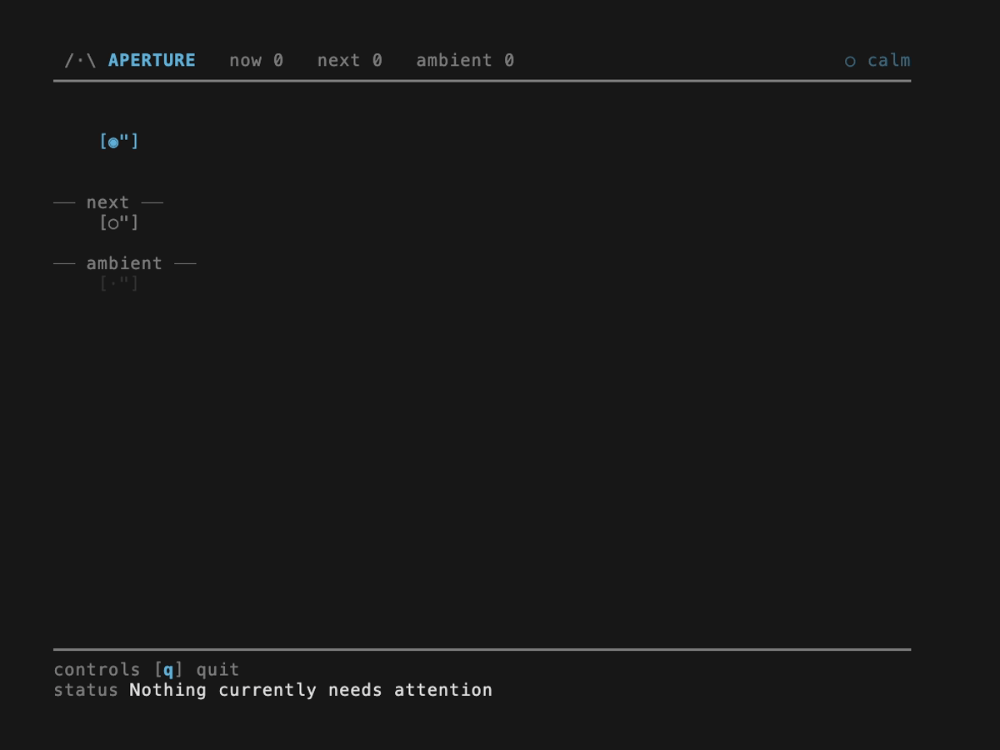

<div align="center">

# Aperture

**The attention surface for agent work.**

[](https://www.npmjs.com/package/@tomismeta/aperture)
[](https://www.npmjs.com/package/@tomismeta/aperture-core)
[](./LICENSE)
[](./docs/product/architecture-overview.md)


<p></p>
</div>

Aperture is the live attention surface for humans working with agents like
Claude Code and OpenCode.

It keeps the agent work that needs you in one place, decides what should be
`now`, what should wait until `next`, and what should stay `ambient`, and sends
your answer back into the same loop.

## Getting Started

There are two clean ways to start:

- **Use the product now**
  - install `@tomismeta/aperture`
  - run `aperture`
  - connect Claude Code or OpenCode and use the TUI
- **Build with the SDK**
  - install `@tomismeta/aperture-core`
  - embed `ApertureCore` in-process inside your own host, workflow, or UI

If you need to send external work into a running Aperture product instance, the
optional local HTTP ingress path is documented in
[Host-Neutral Ingestion Contract](./docs/product/host-neutral-ingestion-contract.md).

## Install The Product

Install the CLI/TUI product:

```bash
npm install -g @tomismeta/aperture
```

Launch Aperture:

```bash
aperture
```

If you use Claude Code, Aperture prepares Claude on first launch. Restart
Claude Code after the first run and confirm `/hooks` loaded.

If you want OpenCode, run:

```bash
opencode serve --port 4096
opencode attach http://127.0.0.1:4096
```

Then launch Aperture:

```bash
aperture
```

## Use The SDK

Package: `@tomismeta/aperture-core`

```bash
npm install @tomismeta/aperture-core
```

The SDK loop is intentionally small:

`ApertureEvent in via core.publish(...) or SourceEvent in via core.publishSourceEvent(...) -> AttentionFrame / AttentionView out -> AttentionResponse in`

See [packages/core/README.md](./packages/core/README.md).

## What You Get

With `@tomismeta/aperture`:

- a local CLI/TUI product
- one shared attention surface for Claude Code and OpenCode, plus experimental Codex support from source
- `now`, `next`, and `ambient` lanes for human attention
- approvals, follow-ups, failures, and blocked work in one place
- doctor, debug, completion, and uninstall commands
- replayable capture bundles for troubleshooting real sessions

With `@tomismeta/aperture-core`:

- the deterministic judgment engine inside Aperture
- a small public SDK loop
- the advanced `/semantic` and `/trace` entrypoints for adapter and explanation consumers

## The Loop

```text
+-----------+    +-------------+    +-------------+    +-------------+    +-------------+
|  Arrive   | -> |  Translate  | -> |    Judge    | -> |    Show     | -> |   Respond   |
|  events   |    |    facts    |    |  attention  |    |   surface   |    |   action    |
+-----------+    +-------------+    +-------------+    +-------------+    +-------------+

agent hooks       explicit facts      does this         what the          operator decision
and server        from raw payloads   deserve           operator          carried back
events                                attention now?    actually sees     to the tool
```

If you only remember one thing, remember this:

`agent events in -> attention surface out -> human response back`

## Current Integrations

### Claude Code

- tool-aware permission frames
- post-tool failure awareness
- non-blocking completion awareness
- waiting and input-needed awareness
- follow-up handoff when Claude ends a turn with a real question

### OpenCode

- permission approvals from the server and terminal path
- structured `question.asked` prompts
- lightweight awareness when OpenCode is blocked waiting for a human reply
- fallback reply handling for follow-up text questions when supported by the server event stream

### Codex (experimental)

- App Server supervision through `pnpm codex:run` and `pnpm codex:start`
- experimental hooks support for the stock Codex CLI
- end-to-end approval routing proven for supported request families
- broader interruption coverage still depends on what Codex App Server externalizes as requests

Claude Code and OpenCode are the mainline live paths today. Codex is a real but still experimental third path.

## Common Product Commands

```bash
aperture
aperture --capture
aperture doctor
aperture debug
aperture completion zsh
aperture --version
aperture help
aperture help opencode
aperture help uninstall
```

## From Source

If you want to work on the repo directly:

```bash
git clone git@github.com:tomismeta/aperture.git
cd aperture
pnpm install
pnpm release:check
```

To launch the product from source:

```bash
pnpm aperture
```

## Package Boundaries

- [`@tomismeta/aperture`](https://www.npmjs.com/package/@tomismeta/aperture)
  - the product
  - CLI/TUI
  - local runtime
  - integration setup and troubleshooting
- [`@tomismeta/aperture-core`](https://www.npmjs.com/package/@tomismeta/aperture-core)
  - the SDK
  - deterministic judgment engine
  - event/frame/response loop

## Links

- Product package: [`@tomismeta/aperture`](https://www.npmjs.com/package/@tomismeta/aperture)
- SDK package: [`@tomismeta/aperture-core`](https://www.npmjs.com/package/@tomismeta/aperture-core)
- Product release notes: [docs/releases/aperture-v0.2.1.md](./docs/releases/aperture-v0.2.1.md)
- SDK release notes: [docs/releases/aperture-core-v0.5.0.md](./docs/releases/aperture-core-v0.5.0.md)
- Architecture overview: [docs/product/architecture-overview.md](./docs/product/architecture-overview.md)
- Attention judgment doctrine: [docs/engine/attention-judgment-doctrine.md](./docs/engine/attention-judgment-doctrine.md)
- Core SDK guide: [packages/core/README.md](./packages/core/README.md)
- Product package guide: [packages/aperture/README.md](./packages/aperture/README.md)
