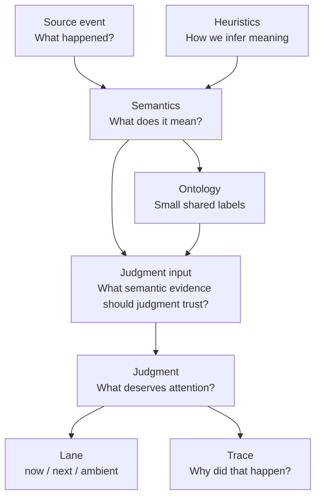

# Aperture Core Mental Model

This is the simplest way to think about Aperture Core.

It is not a schema reference and not an implementation spec.

Its job is to make a few core terms feel obvious:

- core
- semantics
- ontology
- heuristics
- judgment
- trace

## One Simple Map

## The Short Version

- **Core** is the whole decision engine.
- **Semantics** is Aperture's read of what an event means.
- **Ontology** is the small stable vocabulary used to describe that meaning.
- **Heuristics** are the concrete rules that help infer meaning from messy source events.
- **Judgment** is the decision about what belongs in `now`, `next`, or `ambient`.
- **Trace** is the explanation of why that judgment happened.

## How The Pieces Fit

### 1. Source event

This is the raw thing that happened in a host or adapter.

Question:

> What happened?

Examples:

- a task failed
- an approval was requested
- a status update said "waiting for approval"
- a repeated issue came back again

### 2. Semantics

This is Aperture's richer read of the event.

Question:

> What does Aperture think this means?

Examples:

- this is an approval request
- this is a failure
- this is blocked work
- this is the same issue resurfacing
- this read is low confidence

Think of semantics as the **meaning layer**.

### 3. Ontology

This is the small, stable vocabulary Aperture uses to talk about semantics.

Question:

> Which dimensions matter most for supervision?

Current ontology dimensions:

- `ask`
- `activity`
- `consequence`
- `blocking`
- `episode`
- `confidence`
- `source`

Think of ontology as the **compact summary layer**.

Semantics is richer than the ontology.
The ontology is the part we want to stay especially stable and reusable.

Today, the ontology is most first-class in:

- replay and calibration
- F-Stop review
- trace diagnostics
- narrow blocked-like status routing for strong `blocking` reads
- semantic evidence strength from `confidence + source`

Core now compiles ontology and semantic evidence into a small internal judgment
input before policy and planning run.

Judgment still primarily consumes the richer semantic and candidate layers rather
than routing directly on ontology objects.

Actual current data path:

`SourceEvent/ApertureEvent -> finalized event (usually EnrichedApertureEvent) -> AttentionJudgmentInput -> AttentionCandidate -> policy/value/pressure/planning -> lane/trace`

### 4. Heuristics

These are the rules and detectors that help Aperture infer semantics from messy input.

Question:

> How did Aperture figure that out?

Examples:

- phrase detection like `failed again`
- implied-ask detection like `need your approval`
- consequence inference from risky wording
- relation detection like `same issue` or `resolves`

Think of heuristics as the **inference machinery**.

### 5. Judgment

This is the actual attention decision.

Question:

> Given what this means, what should happen?

Outputs:

- `now`
- `next`
- `ambient`

Judgment uses:

- semantic meaning
- compiled judgment input from ontology and semantic evidence
- continuity and episode context
- ambiguity and confidence
- policy and doctrine
- operator pressure and burden

Think of judgment as the **attention-routing layer**.

Status paths keep raw task status authoritative by default, even when the
semantic and ontology reads are richer. Named judgment-input diagnostics, such
as routine observational status conflicts, are the explicit exception path.

### 6. Trace

This is the explanation layer.

Question:

> Why did Aperture make that call?

The trace is how Aperture shows:

- what it read semantically
- what mattered to the decision
- what stayed context-only
- what route was chosen

Think of trace as the **why layer**.

## The Best Practical Mental Model

- **Semantics** = rich read
- **Ontology** = compact vocabulary for discussing that read
- **Heuristics** = machinery that produced the read
- **Judgment** = action taken from the read
- **Trace** = explanation of the action
- **Core** = the whole system tying those layers together

## The Top-Level Abilities

Another clean way to think about Aperture Core is by its top-level abilities:

- **ability to ingest**
  - accept input
  - validate it
  - finalize it for runtime use
- **ability to understand**
  - infer semantics
  - project ontology
  - compile judgment input
- **ability to judge**
  - evaluate
  - route
  - coordinate
- **ability to materialize**
  - commit frames
  - update views
  - handle responses
- **ability to learn**
  - record signals
  - summarize behavior
  - checkpoint memory
- **ability to explain**
  - trace event transitions
  - trace candidate/frame transitions
  - expose why the decision happened

That framing helps keep discussion centered on what the engine must remain able
to do, even when support machinery moves around it.

## One Concrete Example

Event:

> "Need your approval before deploy can continue."

Heuristics may detect:

- operator-directed approval wording
- waiting language
- deploy / risk language

Semantics may read:

- status-shaped implied operator ask
- low-confidence because it is wording-derived rather than source-explicit

Ontology may summarize that as:

- `ask: status`
- `blocking: waiting`
- `activity: task_progress`
- `source: inferred`

Judgment may decide:

- `next`
- `ambient`
- or `now` later if stronger explicit evidence arrives

Trace explains:

- why that route was chosen
- what was inferred
- what actually mattered

## The Core Standard

When discussing semantic improvements, the cleanest questions are:

- Which ontology dimension got better?
- Which heuristic made that possible?
- Did judgment improve as a result?
- Can the trace explain the change clearly?

If those answers are clean, the change is probably helping Aperture mature in a durable way.
