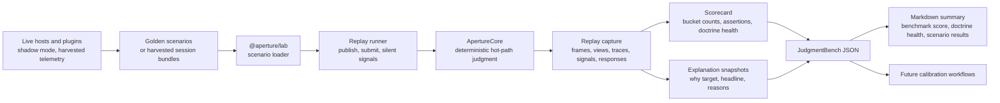

# Aperture Lab

This note defines the first architecture and naming ontology for Aperture's
offline replay, evaluation, benchmark, and calibration system.

The system name is:

- `Aperture Lab`

The initial workspace package is:

- `@aperture/lab`

The first public benchmark identity inside the lab is:

- `JudgmentBench`

## Why This Exists

Aperture's moat should not come only from adapters or surfaces.

It should come from being able to prove, under replay, that Aperture spends
human attention better than simpler queues, inboxes, and approval routers.

That means Aperture needs:

- a replayable scenario format
- a deterministic runner
- a scorecard that reflects doctrine, not vanity metrics
- a path to harvest real attention-significant episodes from live hosts

## Main Rule

Build the replay lab first.

Do not start with a public leaderboard or a separate benchmark repo.

The first milestone is:

- deterministic offline replay against `ApertureCore`
- based on the existing trace, signal, and state surfaces already exported from
  `@tomismeta/aperture-core`

Once the scenario format and metrics are stable, Aperture can promote that work
into a broader benchmark corpus and eventually a public benchmark surface.

## Naming Ontology

The naming split should stay explicit.

### 1. Aperture Lab

`Aperture Lab` is the overall offline system.

It owns:

- replay
- evaluation
- scorecards
- corpus tooling
- harvested session analysis
- future calibration and tuning workflows

This is the broadest name because the capability is broader than a benchmark.

### 2. `@aperture/lab`

`@aperture/lab` is the first in-repo package boundary.

It should hold:

- scenario schemas
- replay runner
- scorecard logic
- corpus loading and analysis helpers
- future calibration helpers

This is the implementation surface for the lab inside the monorepo.

### 3. JudgmentBench

`JudgmentBench` is the first benchmark identity the lab should produce.

It is the doctrine-shaped benchmark surface for:

- named corpora
- named metrics
- replayable comparison results
- future public reporting

This is narrower than the lab itself.

### 4. Autocalibration

`autocalibration` is a future lab capability, not the name of the whole system.

It should eventually use replay and scorecards to refine the deterministic hot
path, but it should remain one mode inside the lab rather than the primary
identity of the benchmark stack.

## Napkin

```text
+----------------+    +-------------------+    +--------------------+    +------------------+
| Scenario or    | -> |   Replay runner   | -> |   ApertureCore     | -> | Trace, signals,  |
| harvested      |    |   applies steps   |    | deterministic      |    | views, responses |
| session bundle |    |   in order        |    | judgment           |    | and scorecard    |
+----------------+    +-------------------+    +--------------------+    +------------------+

synthetic cases       publish / submit         policy / value /          replay result
or real host data     and silent signals       planner / continuity      plus metrics
```

## Mermaid



## What JudgmentBench Measures

The benchmark should measure human-attention quality, not generic agent task
success.

The first-class metric families should be:

- interrupt precision
- missed-critical rate
- queue quality
- continuity preservation
- calmness under load
- operator burden
- decision latency
- ranking regret
- explanation faithfulness

These are the metrics that best map to Aperture's doctrine:

- interruption credibility
- attention worthiness
- queueing instead of needless interruption
- continuity of the current decision stream
- clear reasoning under load

## Corpus Units

The benchmark should not only think in isolated events.

The important units are:

### 1. Scenario bundle

A small deterministic replay fixture.

Contains:

- steps
- expected context
- optional expected outcomes

Best for:

- tests
- regression cases
- golden scenarios

### 2. Session bundle

A redacted harvested bundle from a real host.

Contains:

- source or normalized events
- responses
- silent signals
- traces
- outcome summary

Best for:

- shadow evaluation
- retrospective comparison
- future corpus growth

### 3. Episode slice

A focused decision stream extracted from a larger session.

Best for:

- continuity evaluation
- queue-vs-interrupt analysis
- ranking comparisons

## Initial Architecture

`@aperture/lab` should start with four modules:

### 1. Scenario schema

Defines deterministic replay input:

- publish Aperture event
- publish source event
- submit human response
- emit silent interaction signals

### 2. Replay runner

Runs a scenario against `ApertureCore` and captures:

- returned frames
- attention-view snapshots
- traces
- responses
- signals

### 3. Scorecard

Turns replay output into doctrine-shaped metrics.

This should begin by composing:

- existing `evaluateTraceSession(...)`
- signal summaries
- simple replay-derived counts

### 4. Corpus loader

Loads scenario bundles from disk and gives the runner a stable input surface.

This can stay minimal at first.

## Why It Belongs In-Repo First

The core trace and signal surfaces are still evolving.

Keeping the replay lab in this repo first gives us:

- fast iteration on trace schema and scorecard shape
- fewer versioning problems
- easier golden-scenario testing in CI
- the ability to benchmark core changes before making them public claims

The separate public benchmark repo should come later, after:

- scenario schema is stable
- metrics are stable
- at least one real harvested corpus exists

## How Real Data Enters The System

Synthetic scenarios are necessary but not sufficient.

The long-term moat comes from real attention telemetry.

The right harvesting unit is a redacted attention bundle, not raw agent logs.

The eventual session-bundle shape should preserve:

- source events
- normalized Aperture events
- responses
- silent signals
- traces
- attention-view transitions
- outcome summaries

For the concrete harvesting and labeling plan, see
[JudgmentBench Data Strategy](./judgmentbench-data-strategy.md).

It should avoid collecting:

- unnecessary raw deltas
- chain-of-thought
- irrelevant execution chatter

The goal is a privacy-preserving attention corpus, not a giant undifferentiated
event dump.

## How Autoresearch Fits

An `autoresearch`-style loop is a strong fit for optimization after the replay
lab exists.

The useful pattern is:

- fixed corpus
- fixed scorecard
- many small deterministic changes
- keep or discard based on measured improvement

That should be used for:

- planner-default tuning
- threshold tuning
- continuity tuning
- score sensitivity experiments

It should not be the first thing that defines the benchmark itself.

The corpus and scorecard should be human-shaped and doctrine-shaped before
being optimized automatically.

## First Build Order

1. Add `@aperture/lab`
2. Define scenario and replay-result schemas
3. Implement deterministic replay against `ApertureCore`
4. Implement the first scorecard
5. Add golden scenarios to the repo
6. Add harvested session bundles later
7. Consider a separate public benchmark repo only after the above are stable

## Current Decision

Start with:

- `Aperture Lab` as the system name
- `@aperture/lab` as the in-repo replay/evaluation package
- `JudgmentBench` as the first benchmark identity

That is the right first architecture for becoming the best deterministic human
attention judgment engine in the world.
