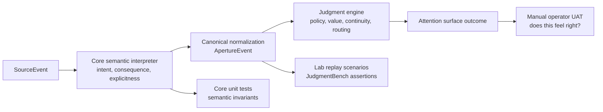

# Semantic Robustness Test Plan

This note defines the working test plan for Aperture's semantic layer across:

- `@tomismeta/aperture-core`
- `@aperture/lab`
- manual operator acceptance testing

The goal is not only to prove that Aperture routes work correctly.
The goal is to prove that Aperture first **reads source events correctly enough**
for deterministic judgment to be meaningful.

## Main Rule

Test the semantic layer in three stacked layers:

1. **Core invariants**
2. **Lab replay and benchmark coverage**
3. **Manual user acceptance testing**

A semantic change is only really healthy when it clears all three.

## Why This Needs Multiple Layers

Each layer catches a different failure mode.

- core tests catch local interpretation regressions
- lab catches scenario-level doctrine drift
- manual testing catches product reality gaps that still feel wrong to a human

If we only do one layer, we will miss important classes of failure:

- core-only misses end-to-end routing impact
- lab-only misses precise interpretation bugs
- manual-only misses regression protection

## Architecture

## Layer 1: Core Invariants

This layer tests the semantic layer directly and should live primarily in:

- [packages/core/test/semantic-normalization.test.ts](/Users/tom/dev/aperture/packages/core/test/semantic-normalization.test.ts)

### What Core Must Prove

Core tests should prove:

- deterministic interpretation for the same input
- explicit semantic hints override bounded inference
- dangerous language can raise consequence when structure is missing
- low-risk language does not get inflated
- implied asks are recognized when wording supports them
- dramatic but passive wording does not invent operator work
- normalized events preserve semantic facts into the engine boundary

### Core Test Families

#### 1. Intent-frame recognition

Examples:

- approval request
- choice request
- form request
- blocked work
- failure
- passive status

Assertions:

- `intentFrame`
- `activityClass`
- `operatorActionRequired`
- `requestExplicitness`

#### 2. Consequence interpretation

Examples:

- destructive production wording
- benign read wording
- adapter-provided escalation
- neutral choice request

Assertions:

- `consequence`
- `confidence`
- `whyNow`
- `reasons`

#### 3. Override precedence

Examples:

- explicit `semanticHints`
- explicit `toolFamily`
- explicit adapter facts vs inferred text cues

Assertions:

- supplied facts win
- reasons/factors are merged, not lost

#### 4. Bounded abstention behavior

Future target:

- add cases where semantics should stay weak or abstained rather than overclaim

Assertions:

- low confidence when appropriate
- no invented blocking semantics

### Core Exit Criteria

A semantic change is ready to move past Layer 1 when:

- relevant semantic unit tests are added
- `pnpm exec tsx --test packages/core/test/**/*.test.ts` passes
- the change preserves deterministic interpretation for repeated identical inputs

## Layer 2: Lab Benchmark Coverage

This layer tests semantic interpretation and routing together through replay.

Primary surfaces:

- [packages/lab/golden](/Users/tom/dev/aperture/packages/lab/golden)
- [packages/lab/src/judgment-bench.ts](/Users/tom/dev/aperture/packages/lab/src/judgment-bench.ts)
- [packages/lab/src/runner.ts](/Users/tom/dev/aperture/packages/lab/src/runner.ts)

### What Lab Must Prove

Lab scenarios should prove both:

1. core read the source event correctly
2. the engine routed it correctly after that reading

This is the layer that answers:

- did the semantic read match doctrine?
- did the routing result still make sense?

### Scenario Buckets

The semantic tranche should keep growing in these buckets:

#### 1. Dangerous wording without explicit structure

Examples:

- destructive commands
- production data operations
- forceful filesystem changes

Goal:

- consequence should rise
- interrupt-worthy approvals should stay credible

#### 2. Low-risk and benign wording

Examples:

- reads
- searches
- informational status

Goal:

- low-consequence work should stay low
- read-like approvals should not be over-inflated

#### 3. Implied ask detection

Examples:

- “waiting for approval”
- “should I continue?”
- “need your input”

Goal:

- semantics can recognize an implied ask
- routing still respects status-vs-blocking doctrine

#### 4. Dramatic but passive wording

Examples:

- “critical path still running”
- “urgent sync still in progress”
- “hot path still running, no action needed”

Goal:

- language alone should not invent interruption-worthy work

#### 5. Explicit host knowledge

Examples:

- `semanticHints`
- trusted policy escalation hints
- tool-family hints

Goal:

- host truth wins over weaker built-in interpretation

#### 6. Future relation semantics

Next tranche:

- same issue, different wording
- resolves / supersedes / repeats
- continuity-safe wording drift

### Lab Assertions

Each semantic scenario should assert both:

- semantic reading:
  - `intentFrame`
  - `activityClass`
  - `operatorActionRequired`
  - `requestExplicitness`
  - `consequence`
  - `confidence`
  - `whyNowIncludes`
  - `reasonsInclude`
- final routing:
  - active / queued / ambient
  - bucket counts
  - explanation headline when helpful

### Lab Exit Criteria

A semantic change is ready to move past Layer 2 when:

- new semantic scenarios were added or existing ones updated intentionally
- `pnpm exec tsx --test packages/lab/test/**/*.test.ts` passes
- `pnpm judgment:bench` passes
- benchmark score remains green
- semantic doctrine tags remain healthy

## Layer 3: Manual User Acceptance Testing

This is the reality check.

The benchmark can be green while the product still feels semantically wrong.

Manual UAT should happen in:

- Aperture TUI
- live adapter flows when available
- plugin/SDK-host flows when available

### What Manual UAT Must Prove

From the operator's perspective:

- does the frame show up in the right bucket?
- does the consequence feel right?
- does the “why” feel truthful?
- does the semantic read overreact to dramatic wording?
- does it miss real implied asks?

### Manual UAT Script

For each round, test at least these five cases:

#### 1. Dangerous approval without a risk hint

Input shape:

- wording like `rm -rf`, production delete, force push, destructive migration

Expected:

- high-consequence approval
- active or clearly interrupt-worthy
- “why” references explicit operator approval or high-risk action

#### 2. Benign read-like approval

Input shape:

- read/search/file inspection wording

Expected:

- low consequence
- no false critical treatment
- still interactive if it is a true approval

#### 3. Implied ask inside status text

Input shape:

- “waiting for approval”
- “need your input before continuing”

Expected:

- semantic layer notices the ask
- routing still feels consistent with status doctrine unless the source truly emitted a blocking request

#### 4. Dramatic passive status

Input shape:

- urgent-sounding but non-actionable status copy

Expected:

- remains peripheral
- no bogus interrupt
- “why” should not imply false urgency

#### 5. Explicit host override

Input shape:

- adapter or host sends `semanticHints`

Expected:

- host-provided meaning wins
- explanation reflects the override cleanly

### Manual UAT Questions

For each case, answer:

1. Did Aperture put it in the right bucket?
2. Did the consequence feel right?
3. Did the “why” feel truthful?
4. Did it overreact to wording?
5. Did it miss an obvious ask?

### Manual UAT Exit Criteria

We should call a semantic tranche healthy only when:

- no case feels obviously misread
- no dangerous wording is undercalled
- no benign wording is overcalled
- the TUI why view matches operator intuition
- any surprising result becomes either:
  - a new core test
  - a new golden scenario
  - or a deliberate doctrine decision

## Runbook

For a normal semantic-layer change, run this order:

1. `pnpm exec tsx --test packages/core/test/**/*.test.ts`
2. `pnpm exec tsx --test packages/lab/test/**/*.test.ts`
3. `pnpm judgment:bench`
4. `pnpm test`
5. manual UAT in the TUI or the relevant host path

## Promotion Rule

A new semantic edge case should graduate through the layers like this:

1. first observed in manual use or design review
2. captured as a golden scenario in Lab
3. reduced into a precise core invariant where possible

That keeps Aperture from learning only in chat or only in operator memory.

## Current Recommendation

For the next maturity phase, expand along two fronts:

- relation semantics
  - same issue / resolves / supersedes / repeats
- adversarial wording cases
  - similar wording with different stakes
  - different wording with the same underlying meaning

That is the fastest path to making the semantic layer feel robust in the wild,
not just correct on the first tranche.
