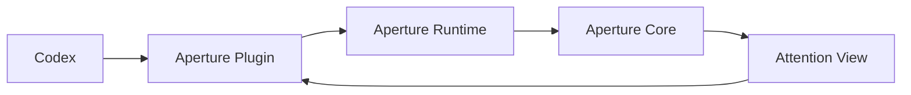

# Codex Plugin Mockup

This note sketches what an **Aperture plugin for Codex** could look like if we
eventually package Aperture as a Codex-native install surface.

This is a **UI/UX mockup**, not a committed roadmap item.

## Product Thesis

The plugin should be a **thin Codex-native distribution and attachment layer**
for Aperture, not a second judgment engine.

That means:

- Codex continues to own execution and native product flow
- Aperture continues to own attention judgment and continuity
- the plugin makes Aperture easier to install, attach, understand, and debug

## Design Principles

1. **Start from attachment, not replacement**

The plugin should help Codex users connect to Aperture. It should not try to
replace the Codex work surface.

2. **Keep the human attention surface legible**

The plugin should make it obvious that Aperture is where the user goes for:

- blocked work
- approvals
- follow-up questions
- recurring same-issue attention

3. **Make setup feel first-class**

The first-run experience should be strong enough that a Codex user understands:

- what Aperture is
- what it is attached to
- whether it is healthy
- where attention will appear

4. **Bias toward calm status**

The default plugin view should be light, reassuring, and diagnostic. It should
not feel like a second inbox unless something truly needs attention.

## Mental Model



The plugin is the **Codex-native shell** around:

- install/setup skills
- runtime bridge tools
- lightweight status surfaces

The actual attention model still lives underneath.

## Mockup 1: Plugin Card

This is the install/discovery surface inside Codex.

```text
+--------------------------------------------------------------------+
| APERTURE                                                           |
| The attention layer for agent work                                 |
|                                                                    |
| Keep approvals, blocked work, follow-up questions, and recurring   |
| issues in one calm surface while Codex keeps coding.               |
|                                                                    |
| Capabilities                                                       |
| [ Read ] [ Write ] [ Status ] [ Review ]                           |
|                                                                    |
| Includes                                                           |
| - setup skills                                                     |
| - local runtime bridge                                             |
| - optional status panel                                            |
|                                                                    |
| [ Install ]                                   by tomismeta         |
+--------------------------------------------------------------------+
```

### Why this shape

- speaks in product value first
- does not oversell automation
- makes Aperture feel complementary to Codex, not competitive with it

## Mockup 2: First-Run Attach Flow

This is the most important screen in the whole concept.

```text
+--------------------------------------------------------------------+
| Aperture Setup                                                     |
|                                                                    |
| Aperture helps you manage the human side of agent work.            |
|                                                                    |
| It can surface:                                                    |
| - approvals                                                        |
| - follow-up questions                                              |
| - blocked work                                                     |
| - recurring unresolved issues                                      |
|                                                                    |
| Current status                                                     |
| [✓] Plugin installed                                               |
| [✓] Local runtime found                                            |
| [ ] Codex session attached                                         |
|                                                                    |
| Attention destination                                              |
| (•) Open Aperture TUI                                              |
| ( ) Keep status in Codex only                                      |
|                                                                    |
| [ Attach This Session ]     [ Run Doctor ]     [ Skip For Now ]    |
+--------------------------------------------------------------------+
```

### Why this shape

- explains the product in operational language
- shows attachment as the key action
- gives a graceful path for users who just want to explore

## Mockup 3: Codex Sidebar / Status Panel

This is the default “calm when healthy” view.

```text
+--------------------------------------------------+
| Aperture                                         |
| calm                                             |
|                                                  |
| Session                                           |
| Codex thread attached                            |
| Runtime healthy                                  |
| Last sync: just now                              |
|                                                  |
| Attention                                         |
| now 0   next 1   ambient 2                       |
|                                                  |
| Top queued item                                   |
| Follow-up needed on migration plan               |
| from repo/infra                                  |
|                                                  |
| Recent signals                                    |
| - approval auto-resolved locally                  |
| - issue resurfaced after defer                    |
| - one task completed                              |
|                                                  |
| [ Open Aperture ]                                 |
| [ Explain Current State ]                         |
| [ Doctor ]                                        |
+--------------------------------------------------+
```

### Why this shape

- calm by default
- enough signal to create trust
- encourages the user to go to Aperture when attention gets real

## Mockup 4: Attention Handoff

This is the moment where the plugin stops being a status shell and becomes a
handoff surface.

```text
+--------------------------------------------------------------------+
| Needs Attention                                                    |
|                                                                    |
| Recurring issue resurfaced under active blocker                    |
|                                                                    |
| Why this is visible now                                            |
| - same issue has returned repeatedly                               |
| - it stayed queued while blocking work was active                  |
| - it now needs review before more work piles up                    |
|                                                                    |
| Options                                                            |
| [ Open In Aperture ]                                               |
| [ View Trace ]                                                     |
| [ Keep Queued ]                                                    |
|                                                                    |
| Source: Codex thread alpha                                         |
+--------------------------------------------------------------------+
```

### Why this shape

- uses Aperture language, not Codex-internal language
- explains *why now*, not just *what happened*
- keeps the plugin as an orientation surface rather than a full inbox

## Mockup 5: Command Palette Actions

The plugin should also feel good from a command palette or slash-command flow.

```text
> Aperture: Attach current Codex session
> Aperture: Open attention surface
> Aperture: Explain current attention state
> Aperture: Run doctor
> Aperture: Export local trace
```

### Why this shape

- fits Codex power-user behavior
- keeps the plugin useful even without a rich app surface

## Interaction Model

The best interaction shape is:

1. plugin installs cleanly
2. user attaches the current Codex session to Aperture
3. plugin stays mostly quiet
4. plugin shows a calm status panel
5. when attention becomes real, plugin hands off to Aperture

That means the plugin should feel more like:

- a bridge
- a guide
- a status shell

than:

- a second IDE pane
- a separate task manager
- a parallel judgment layer

## What V1 Should Include

- plugin manifest and install metadata
- setup and doctor skills
- one local Aperture bridge path
- a calm status panel
- command-palette actions

## What V1 Should Not Include

- a full Codex-native attention inbox
- duplicated queueing logic
- Codex-specific routing heuristics
- a large review UI
- a parallel settings matrix

## Visual Tone

The plugin should feel:

- precise
- calm
- diagnostic
- trustworthy

It should not feel:

- salesy
- noisy
- over-animated
- more complicated than the problem it solves

## Recommended Build Order

1. plugin card + install metadata
2. first-run attach flow
3. calm status panel
4. command-palette actions
5. only then consider a richer app or handoff pane

## Summary

If Aperture ever ships as a Codex plugin, the right first impression is:

**“Codex keeps coding. Aperture keeps the human oriented.”**

That is the product shape this mockup is trying to preserve.
