# Architecture Overview

This document is the living architectural overview for Aperture.

It should answer four questions clearly:

- where events come from
- where meaning is established
- where judgment happens
- how decisions become surfaced state and responses back to the source

The goal is not to capture every implementation detail.
The goal is to keep the main system shape understandable and current.

## The Main Layering

Aperture is easiest to understand as nine connected layers, with one offline loop
beside them:

1. **Source Hosts**
   - Owned by: external tools
   - The tools where work originates.
   - Today that means Claude Code, OpenCode, and Codex.

2. **Source Adapters**
   - Owned by: adapter packages
   - Source-specific translators.
   - They turn native payloads into Aperture `SourceEvent` values.
   - Their job is to provide explicit facts when the source knows them.

3. **Runtime Attachment**
   - Owned by: runtime or direct host integration
   - The place where adapters attach to a shared runtime, or connect directly to
     core in-process.
   - This is transport and hosting, not judgment.

4. **Event Intake and Normalization**
   - Owned by: `@tomismeta/aperture-core`
   - The engine intake path.
   - It validates events, normalizes them, evaluates candidate shape, applies
     bounded adjustments, and assigns episode context.

5. **Evidence Context**
   - Owned by: `@tomismeta/aperture-core`
   - The shared picture of what is true right now.
   - This includes the current surface state, signal summaries, operator
     presence, pressure, burden, and surface capabilities.

6. **Deterministic Judgment Engine**
   - Owned by: `@tomismeta/aperture-core`
   - The authoritative live decision path.
   - This is where policy, value, routing, and continuity run.

7. **State, Trace, and Learning**
   - Owned by: `@tomismeta/aperture-core`
   - The layer that commits decisions into surfaced state.
   - It also records traces, interaction signals, and compact learned summaries.

8. **Operator and Client Surfaces**
   - Owned by: `@aperture/tui` and any future client surface
   - The places where a human or other client consumes Aperture.
   - Today that mainly means the TUI operator surface, the TUI why surface,
     and any future client consuming the same core contracts.

9. **Response Return Path**
   - Owned by: core plus the relevant adapter or host integration
   - The path where human responses are validated, applied, and translated back
     into source-native actions.

**Offline Evaluation**
- Owned by: tooling beside the live engine
- Replay, scenario review, and threshold tuning.
- This should shape the live engine indirectly, not sit in the hot path.

## Package Boundary Summary

The repo is easiest to understand with this ownership split:

- **External tools** own the raw source events.
- **Adapter packages** own source translation and explicit semantic facts.
- **`@tomismeta/aperture-core`** owns normalization, evidence, judgment, state,
  trace, and learning.
- **`@aperture/runtime`** owns shared live hosting and transport.
- **`@aperture/tui`** owns the terminal operator surface.
- **Offline tooling** owns replay, evaluation, and supporting analysis.

This is the practical implementation form of the main architectural rule:

**Adapters provide facts. Core provides judgment.**

## Live Path Summary

The live authoritative path is:

1. **Event Intake and Normalization**
2. **Evidence Context**
3. **Deterministic Judgment Engine**
4. **State, Trace, and Learning**

These layers are where Aperture's real product behavior is decided.

The surrounding layers are still important, but they play different roles:

- **Source Hosts** and **Source Adapters** provide the input facts
- **Runtime Attachment** provides transport and hosting
- **Operator and Client Surfaces** render and inspect the result
- **Response Return Path** carries human action back to the source
- **Offline Evaluation** improves the system without entering the hot path

## Architectural Rule

The main boundary rule is:

**Adapters provide facts. Core provides judgment.**

That means:

- source-specific semantics belong at the adapter boundary
- canonical normalization belongs in core
- routing-critical judgment should prefer explicit semantics over loose text
  inference
- the live decision path should stay deterministic and replayable

## Color Legend

Both diagrams use the same visual language:

- **Green** = explicit semantics and factual translation
- **Yellow** = heuristics or bounded inference
- **Blue** = deterministic live judgment
- **Purple** = committed state, trace, and learning
- **Orange** = human response and source return path
- **Gray** = runtime, infrastructure, or offline support paths

## Diagram 1: End-To-End System

This view shows the full system from source event to human response and back out.

Use this horizontal view to compare the major layers and support paths
side by side.

```mermaid
flowchart LR
  subgraph L1["1. Source Hosts"]
    CC["Claude Code"]
    OC["OpenCode"]
    CX["Codex"]
  end

  subgraph L2["2. Source Adapters"]
    A1["Claude adapter
Turns Claude hook payloads into Aperture source events"]
    A2["OpenCode adapter
Turns OpenCode server events into Aperture source events"]
    A3["Codex adapter
Turns Codex requests and approvals into Aperture source events"]
    AF["Adapter facts
Explicit semantics when known:
tool family, activity class, request type, risk hints, source identity"]
    AH["Adapter fallback heuristics
Used only when the source does not provide enough explicit facts"]
  end

  CC --> A1 --> AF
  OC --> A2 --> AF
  CX --> A3 --> AF
  AH -.-> AF

  subgraph L3["3. Runtime Attachment"]
    RT["Shared Aperture runtime
Hosts one live engine and shared surfaces"]
    DP["Direct in-process attachment
Sends source events straight into the engine"]
  end

  AF --> RT
  AF --> DP

  subgraph L4["4. Event Intake and Normalization"]
    V["Validation
Checks source event and canonical event shape"]
    N["Semantic normalization
Turns SourceEvent into ApertureEvent"]
    E["Event evaluation
Decides whether the event implies a candidate, a clear, or a no-op"]
    J["Bounded adjustments
Applies recent local nudges from signal patterns"]
    EP["Episode tracking
Assigns interaction and episode context"]
    TX["Interaction taxonomy
Prefers explicit tool family and uses bounded fallback inference only where allowed"]
  end

  RT --> V
  DP --> V
  V --> N --> E --> J --> EP
  TX -.-> E
  TX -.-> J
  TX -.-> EP

  subgraph L5["5. Evidence Context"]
    SS["Signal summaries
What recent and lifetime behavior say about attention use"]
    PR["Attention pressure
Forecast of interruption demand building up"]
    BU["Attention burden
Estimate of current cognitive load"]
    EC["Evidence context
Current frame, visible state, operator presence, pressure, burden, surface limits"]
  end

  SS --> PR
  SS --> BU
  PR --> EC
  BU --> EC
  EP --> EC

  subgraph L6["6. Deterministic Judgment Engine"]
    PG["Policy gates
Hard rules about what is allowed or forbidden"]
    VL["Value lane
Named scoring components:
priority, consequence, tone, trust, context cost, response affinity, memory"]
    PC["Policy criterion
Rules that shape interrupt eligibility and threshold behavior"]
    PL["Planner and routing
Chooses active, queued, ambient, keep, or clear"]
    CR["Continuity rules
Protect focus, preserve episodes, avoid bursty switching, keep streams coherent"]
    JD["Judgment coordinator
Produces the final decision and explanation"]
  end

  EC --> PG
  EC --> VL
  EC --> PC
  EC --> PL
  EC --> CR

  PG --> PC
  VL --> PL
  PC --> PL
  PL --> CR

  PG --> JD
  VL --> JD
  PC --> JD
  PL --> JD
  CR --> JD

  subgraph L7["7. State, Trace, and Learning"]
    FP["Frame planning
Turns the decision into a renderable frame"]
    TV["Task view store
Maintains per-task active, queued, and ambient state"]
    AV["Attention view assembly
Builds the global active, queued, and ambient surface"]
    SG["Signal store
Records presented, responded, dismissed, deferred, returned, shifted"]
    TR["Trace recorder
Records rule evaluations, score parts, route, and surfaced result"]
    MM["Memory distillation
Summarizes useful long-term behavior patterns"]
    PS["Optional profile and markdown persistence
Keeps local state and judgment config on disk"]
  end

  JD --> FP --> TV --> AV
  TV --> SG
  JD --> TR
  AV --> TR
  SG --> MM
  MM -.-> PS
  PS -.-> PG
  PS -.-> VL

  subgraph L8["8. Operator and Client Surfaces"]
    API["Surface API
Current attention view, current state, traces, submit"]
    TUI["TUI operator mode
Calm attention surface for now, next, and background"]
    WHY["TUI why mode
Inspection view for route, policy, criterion, continuity, and surfaced result"]
    OTH["Other clients
Tests and future surfaces"]
  end

  AV --> API
  TR --> API
  API --> TUI
  API --> WHY
  API --> OTH

  subgraph L9["9. Response Return Path"]
    SUB["Submit response
Validate the response, apply it, update state, emit signals"]
    RM["Response mapping
Turn AttentionResponse back into a source-native action"]
    OUT1["Claude response path"]
    OUT2["OpenCode response path"]
    OUT3["Codex response path"]
  end

  TUI --> SUB
  OTH --> SUB
  SUB --> SG
  SUB --> TV
  SUB --> RM
  RM --> OUT1
  RM --> OUT2
  RM --> OUT3

  subgraph L10["Offline Evaluation"]
    EVL["Replay and evaluation
Compare traces, review scenarios, tune thresholds, study disagreement"]
  end

  TR --> EVL
  SG --> EVL
  MM --> EVL

  classDef source fill:#f6f7f8,stroke:#6b7280,color:#111827;
  classDef semantics fill:#e8f5e9,stroke:#2e7d32,color:#111827;
  classDef heuristic fill:#fff8e1,stroke:#f59e0b,color:#111827;
  classDef judgment fill:#e8f1ff,stroke:#2563eb,color:#111827;
  classDef state fill:#f3e8ff,stroke:#7c3aed,color:#111827;
  classDef egress fill:#fff3e0,stroke:#ea580c,color:#111827;
  classDef infra fill:#f3f4f6,stroke:#9ca3af,color:#111827,stroke-dasharray: 5 5;

  class CC,OC,CX source;
  class A1,A2,A3,AF,N semantics;
  class AH,J,TX heuristic;
  class V,E,EP,SS,PR,BU,EC,PG,VL,PC,PL,CR,JD,FP judgment;
  class TV,AV,SG,TR,MM,PS state;
  class SUB,RM,OUT1,OUT2,OUT3 egress;
  class RT,DP,API,TUI,WHY,OTH,EVL infra;
```

## Diagram 2: Judgment Engine Deep Dive

This view zooms into the deterministic engine itself.

It follows the same top-to-bottom logic as the full system diagram:

- a candidate arrives with context
- policy decides what is allowed
- value decides how worthwhile attention is
- criterion sets the interrupt bar
- planning picks a route
- continuity protects focus
- the final route is committed into surfaced state

It also makes the four rule categories explicit:

1. policy gates
2. policy criterion
3. planner and routing
4. continuity

```mermaid
flowchart TD
  subgraph E["Evidence and Candidate Context"]
    C["Candidate from event intake<br/>Normalized interaction with episode context and bounded adjustments"]
    X["Shared evidence context<br/>What is visible now, how busy the surface is, and how much load is building"]
  end

  subgraph G["Rule Category 1: Policy Gates"]
    G1["Configured policy<br/>Applies operator-owned rules<br/>(configured_policy)"]
    G2["Blocking work policy<br/>Keeps progress-blocking work interruptive<br/>(blocking)"]
    G3["Background work policy<br/>Keeps background work peripheral<br/>(background)"]
    G4["Peripheral status policy<br/>Keeps passive status from acting urgent<br/>(peripheral_status)"]
    G5["Interruptive default policy<br/>Applies the default attention posture<br/>(interruptive_default)"]
    GV["Policy gate verdict<br/>What hard policy already allows, forbids, or constrains"]
  end

  subgraph V["Named Value Lane"]
    V1["Base attention value<br/>Scores priority, consequence, tone, and blocking-ness"]
    V2["Memory and trust effects<br/>Adjusts value using trust and learned response patterns"]
    VS["Value result<br/>Named score parts and the reasons they moved the candidate"]
  end

  subgraph C1["Rule Category 2: Policy Criterion"]
    C2["Operator absence criterion<br/>Raises or reshapes the interrupt bar<br/>(operator_absence)"]
    C3["Interrupt eligibility criterion<br/>Decides whether this work may interrupt at all<br/>(interrupt_eligibility)"]
    C4["No-active-frame criterion<br/>Handles the special case where the surface is empty<br/>(no_active_frame)"]
    C5["Small-score-gap criterion<br/>Avoids noisy switching on near-ties<br/>(small_score_gap)"]
    C6["Source trust criterion<br/>Requires a clearer margin for lower-trust sources<br/>(source_trust)"]
    C7["Attention budget criterion<br/>Raises the bar when demand is already high<br/>(attention_budget)"]
    CV["Criterion verdict<br/>Threshold, required margin, ambiguity, and peripheral preservation"]
  end

  subgraph P["Rule Category 3: Planner and Routing"]
    P1["Planner<br/>Combines value, criterion, pressure, backlog, and episode state"]
    PV["Initial routing decision<br/>Activate, queue, ambient, keep, or clear"]
  end

  subgraph K["Rule Category 4: Continuity"]
    K1["Visible episode continuity<br/>Keeps visible related work bundled<br/>(visible_episode)"]
    K2["Same-episode continuity<br/>Keeps one episode from fragmenting<br/>(same_episode)"]
    K3["Minimum dwell continuity<br/>Prevents premature switching<br/>(minimum_dwell)"]
    K4["Burst dampening continuity<br/>Suppresses rapid-fire updates<br/>(burst_dampening)"]
    K5["Same-interaction continuity<br/>Refreshes existing work in place<br/>(same_interaction)"]
    K6["Deferral escalation continuity<br/>Lets repeated deferrals return more strongly<br/>(deferral_escalation)"]
    K7["Conflicting interrupt continuity<br/>Resolves competing interruptions<br/>(conflicting_interrupt)"]
    K8["Decision-stream continuity<br/>Protects one stream from another stealing focus<br/>(decision_stream_continuity)"]
    K9["Context patience continuity<br/>Protects focus when context is still worth preserving<br/>(context_patience)"]
    KV["Continuity-adjusted route<br/>The final route after focus protection rules run"]
  end

  subgraph D["Decision and Commit"]
    D1["Judgment coordinator<br/>Assembles one explanation across all judgment lanes"]
    D2["Frame planning<br/>Turns the decision into a renderable frame"]
    D3["Task view store<br/>Commits per-task active, queued, and ambient state"]
    D4["Attention view<br/>Builds the global surfaced view"]
    D5["Trace recorder<br/>Records rule evaluations, score parts, route, and surfaced bucket"]
  end

  C --> G1
  C --> V1
  C --> C2
  X --> G1
  X --> V1
  X --> C2

  G1 --> G2 --> G3 --> G4 --> G5 --> GV
  V1 --> V2 --> VS
  GV --> C2
  C2 --> C3 --> C4 --> C5 --> C6 --> C7 --> CV
  VS --> P1
  CV --> P1
  X --> P1
  P1 --> PV
  PV --> K1 --> K2 --> K3 --> K4 --> K5 --> K6 --> K7 --> K8 --> K9 --> KV

  GV --> D1
  VS --> D1
  CV --> D1
  PV --> D1
  KV --> D1

  KV --> D2 --> D3 --> D4
  D1 --> D5
  D4 --> D5

  classDef semantics fill:#e8f5e9,stroke:#2e7d32,color:#111827;
  classDef heuristic fill:#fff8e1,stroke:#f59e0b,color:#111827;
  classDef judgment fill:#e8f1ff,stroke:#2563eb,color:#111827;
  classDef state fill:#f3e8ff,stroke:#7c3aed,color:#111827;

  class C,X semantics;
  class G1,G2,G3,G4,G5,GV,C2,C3,C4,C5,C6,C7,CV,P1,PV,K1,K2,K3,K4,K5,K6,K7,K8,K9,KV,D1 judgment;
  class V1,V2,VS heuristic;
  class D2,D3,D4,D5 state;
```

## What To Keep Updated

This document should be updated when any of these change:

- a new major layer is introduced
- the adapter/core boundary changes
- the live judgment order changes
- a new public surface is added
- a new rule category appears
- traces or surfaced-state commit move to a different layer

It does **not** need to be updated for:

- small rule tweaks within an existing category
- threshold changes
- cosmetic TUI changes
- test-only refactors

## Code Anchors

### Source adapters

- [Claude adapter](/Users/tom/dev/aperture/packages/claude-code/src/index.ts)
- [OpenCode mapping](/Users/tom/dev/aperture/packages/opencode/src/mapping.ts)
- [Codex adapter](/Users/tom/dev/aperture/packages/codex/src/index.ts)

### Core ingress

- [semantic-normalizer.ts](/Users/tom/dev/aperture/packages/core/src/semantic-normalizer.ts)
- [event-evaluator.ts](/Users/tom/dev/aperture/packages/core/src/event-evaluator.ts)
- [interaction-taxonomy.ts](/Users/tom/dev/aperture/packages/core/src/interaction-taxonomy.ts)
- [episode-tracker.ts](/Users/tom/dev/aperture/packages/core/src/episode-tracker.ts)

### Deterministic judgment engine

- [attention-policy.ts](/Users/tom/dev/aperture/packages/core/src/attention-policy.ts)
- [attention-value.ts](/Users/tom/dev/aperture/packages/core/src/attention-value.ts)
- [attention-planner.ts](/Users/tom/dev/aperture/packages/core/src/attention-planner.ts)
- [continuity/](/Users/tom/dev/aperture/packages/core/src/continuity)
- [judgment-coordinator.ts](/Users/tom/dev/aperture/packages/core/src/judgment-coordinator.ts)

### State, trace, and learning

- [frame-planner.ts](/Users/tom/dev/aperture/packages/core/src/frame-planner.ts)
- [task-view-store.ts](/Users/tom/dev/aperture/packages/core/src/task-view-store.ts)
- [trace-recorder.ts](/Users/tom/dev/aperture/packages/core/src/trace-recorder.ts)
- [memory-aggregator.ts](/Users/tom/dev/aperture/packages/core/src/memory-aggregator.ts)
- [profile-store.ts](/Users/tom/dev/aperture/packages/core/src/profile-store.ts)

### Operator surfaces

- [render.ts](/Users/tom/dev/aperture/packages/tui/src/render.ts)
- [render-why.ts](/Users/tom/dev/aperture/packages/tui/src/render-why.ts)
- [index.ts](/Users/tom/dev/aperture/packages/tui/src/index.ts)
