# System Architecture Diagram

This is the full end-to-end Aperture system view:

- source hosts
- adapters
- runtime attachment
- core ingress
- deterministic judgment lanes
- state commit and traces
- TUI surfaces
- response routing back to sources

It also marks where:

- explicit semantics enter
- bounded heuristics still exist
- the four rule categories execute

## Diagram

```mermaid
flowchart LR
  subgraph S["1. Source Hosts"]
    CC["Claude Code<br/>hooks, notifications, tool events"]
    OC["OpenCode<br/>SSE events, permissions, questions"]
    CX["Codex<br/>request/approval boundary"]
  end

  subgraph A["2. Adapters"]
    AC["Claude adapter<br/>packages/claude-code"]
    AO["OpenCode adapter<br/>packages/opencode"]
    AX["Codex adapter<br/>packages/codex"]
    AF["Adapter facts output<br/>SourceEvent<br/><br/>explicit semantics when known:<br/>toolFamily<br/>activityClass<br/>request kind<br/>risk hints<br/>source identity"]
    AH["Adapter fallback heuristics<br/><br/>source-local parsing only<br/>used when upstream omits facts"]
  end

  CC --> AC --> AF
  OC --> AO --> AF
  CX --> AX --> AF
  AH -.-> AF

  subgraph T["3. Attachment / Transport"]
    RT["Shared runtime<br/>packages/runtime"]
    DP["Direct in-process core attach<br/>publishSourceEvent(...)"]
  end

  AF --> RT
  AF --> DP

  subgraph CI["4. Core Ingress"]
    V["Validation<br/>assertValidSourceEvent / assertValidEvent"]
    SN["Semantic normalizer<br/>SourceEvent -> ApertureEvent"]
    EV["EventEvaluator<br/>ApertureEvent -> candidate / clear / noop"]
    ADJ["AttentionAdjustments<br/>bounded in-session score offsets"]
    EP["EpisodeTracker<br/>episode assignment / evidence"]
    TAX["Interaction taxonomy<br/>readExplicitToolFamily()<br/>readBoundedToolFamily()<br/>inferToolFamily() fallback"]
  end

  RT --> V
  DP --> V
  V --> SN --> EV --> ADJ --> EP
  TAX -.-> EV
  TAX -.-> ADJ

  subgraph EC["5. Evidence Context"]
    SIGSUM["Signal summaries<br/>recent + lifetime behavior"]
    PRESS["forecastAttentionPressure()<br/>pressure ladder"]
    BURDEN["deriveAttentionBurden()<br/>burden ladder"]
    EVID["AttentionEvidenceContext<br/><br/>current frame<br/>surface capabilities<br/>operator presence<br/>signal summaries<br/>pressure + burden"]
  end

  SIGSUM --> PRESS
  SIGSUM --> BURDEN
  PRESS --> EVID
  BURDEN --> EVID
  EP --> EVID

  subgraph J["6. Deterministic Judgment Engine"]
    PG["Rule Category 1<br/>Policy gates<br/><br/>configured_policy<br/>blocking<br/>background<br/>peripheral_status<br/>interruptive_default"]
    VAL["Named value lane<br/><br/>priority<br/>consequence<br/>tone<br/>blocking<br/>heuristics<br/>source trust<br/>consequence calibration<br/>response affinity<br/>context cost<br/>deferral affinity"]
    PC["Rule Category 2<br/>Policy criterion<br/><br/>operator_absence<br/>interrupt_eligibility<br/>no_active_frame<br/>small_score_gap<br/>source_trust<br/>attention_budget"]
    PLAN["Rule Category 3<br/>Planner / routing<br/><br/>activate<br/>queue<br/>ambient<br/>keep<br/>clear"]
    CONT["Rule Category 4<br/>Continuity rules<br/><br/>visible_episode<br/>same_episode<br/>minimum_dwell<br/>burst_dampening<br/>same_interaction<br/>deferral_escalation<br/>conflicting_interrupt<br/>decision_stream_continuity<br/>context_patience"]
    DEC["JudgmentCoordinator<br/>final decision + explanation"]
  end

  EVID --> PG
  EVID --> VAL
  EVID --> PC
  EVID --> PLAN
  EVID --> CONT
  PG --> PC
  VAL --> PLAN
  PC --> PLAN
  PLAN --> CONT
  PG --> DEC
  VAL --> DEC
  PC --> DEC
  PLAN --> DEC
  CONT --> DEC

  subgraph ST["7. State, Trace, Learning"]
    FP["FramePlanner<br/>candidate -> AttentionFrame"]
    TV["TaskViewStore<br/>task active / queued / ambient"]
    AV["buildAttentionView()<br/>global active / queued / ambient"]
    SIG["AttentionSignalStore<br/><br/>presented<br/>responded<br/>dismissed<br/>deferred<br/>returned<br/>attention_shifted"]
    TR["TraceRecorder<br/><br/>rule evals<br/>scores<br/>route<br/>resultBucket"]
    MEM["distillMemoryProfile()<br/>compact learned summaries"]
    PROF["ProfileStore / markdown helpers<br/>optional persistence boundary"]
  end

  DEC --> FP --> TV --> AV
  TV --> SIG
  DEC --> TR
  AV --> TR
  SIG --> MEM
  MEM -.-> PROF
  PROF -.-> PG
  PROF -.-> VAL

  subgraph U["8. Surfaces"]
    SURF["Core / runtime surface APIs<br/><br/>getAttentionView()<br/>getAttentionState()<br/>onTrace()<br/>submit()"]
    TUI["TUI operator mode<br/><br/>active<br/>queued<br/>ambient<br/>judgment line<br/>posture"]
    WHY["TUI why mode<br/><br/>route + surface<br/>policy<br/>criterion<br/>continuity"]
    CLI["Other clients / tests / future UIs"]
  end

  AV --> SURF
  TR --> SURF
  SURF --> TUI
  SURF --> WHY
  SURF --> CLI

  subgraph R["9. Response / Egress"]
    SUB["submit(response)<br/>validate -> apply -> emit signals"]
    MAP["Adapter response mapping<br/>AttentionResponse -> native action"]
    CCO["Claude response path"]
    OCO["OpenCode response path"]
    CXO["Codex response path"]
  end

  TUI --> SUB
  CLI --> SUB
  SUB --> SIG
  SUB --> TV
  SUB --> MAP
  MAP --> CCO
  MAP --> OCO
  MAP --> CXO

  subgraph O["10. Offline Evaluation"]
    REPLAY["Replay / eval / tuning<br/><br/>golden scenarios<br/>trace comparison<br/>threshold refinement"]
  end

  TR --> REPLAY
  SIG --> REPLAY
  MEM --> REPLAY
```

## Legend

- Explicit semantics enter at the adapter `SourceEvent` boundary.
- Bounded heuristics still exist in:
  - adapter-local fallback parsing
  - `AttentionAdjustments`
  - bounded tool-family fallback for generic approvals
- The authoritative live routing path remains deterministic:
  - policy
  - value
  - criterion
  - planner
  - continuity
  - state commit

## Code Anchors

- Adapters:
  - [Claude adapter](/Users/tom/dev/aperture/packages/claude-code/src/index.ts)
  - [OpenCode mapping](/Users/tom/dev/aperture/packages/opencode/src/mapping.ts)
  - [Codex adapter](/Users/tom/dev/aperture/packages/codex/src/index.ts)
- Core ingress:
  - [semantic-normalizer.ts](/Users/tom/dev/aperture/packages/core/src/semantic-normalizer.ts)
  - [event-evaluator.ts](/Users/tom/dev/aperture/packages/core/src/event-evaluator.ts)
  - [interaction-taxonomy.ts](/Users/tom/dev/aperture/packages/core/src/interaction-taxonomy.ts)
- Judgment lanes:
  - [attention-policy.ts](/Users/tom/dev/aperture/packages/core/src/attention-policy.ts)
  - [attention-value.ts](/Users/tom/dev/aperture/packages/core/src/attention-value.ts)
  - [attention-planner.ts](/Users/tom/dev/aperture/packages/core/src/attention-planner.ts)
  - [continuity/](/Users/tom/dev/aperture/packages/core/src/continuity)
- State and trace:
  - [task-view-store.ts](/Users/tom/dev/aperture/packages/core/src/task-view-store.ts)
  - [trace-recorder.ts](/Users/tom/dev/aperture/packages/core/src/trace-recorder.ts)
- TUI:
  - [render.ts](/Users/tom/dev/aperture/packages/tui/src/render.ts)
  - [render-why.ts](/Users/tom/dev/aperture/packages/tui/src/render-why.ts)
