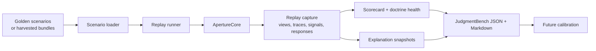

# Aperture Lab

Replay, scorecard, benchmark, and calibration scaffolding for Aperture.

This package is the first implementation surface behind **Aperture Lab**.

Its job is to run deterministic scenarios against
[`@tomismeta/aperture-core`](https://www.npmjs.com/package/@tomismeta/aperture-core),
capture traces and signals, and turn the result into doctrine-shaped
evaluation output.

The first benchmark identity produced by this package should be
**JudgmentBench**.

## Napkin

```text
+----------------+    +-------------------+    +--------------------+    +------------------+
| Scenario or    | -> |   Replay runner   | -> |   ApertureCore     | -> | Trace, signals,  |
| session bundle |    |   applies steps   |    | deterministic      |    | views, responses |
+----------------+    +-------------------+    +--------------------+    +------------------+

fixture or            publish / submit         policy / value /          replay result
harvested data        and silent signals       planner / continuity      plus scorecard
```

## Architecture



## What This Package Owns

- scenario schemas
- replay execution
- replay result capture
- scorecards for doctrine-shaped metrics

## What It Does Not Own

- live runtime hosting
- source adapters
- the TUI
- benchmark branding or leaderboard surfaces

Those remain elsewhere in the repo for now.

## Current Shape

Today this package provides:

- a deterministic replay scenario format
- a runner that applies steps against `ApertureCore`
- a replay result object with frames, view snapshots, traces, signals, and
  responses
- normalized event snapshots for `publishSource` steps, so harvested bundles can
  preserve both source-native and canonical event views
- semantic snapshots for `publishSource` steps, so the lab can test how core
  read a source event before the full judgment loop ran
- decision snapshots for publish steps, so the lab can test how ambiguity and
  semantic confidence affected routing
- trace-level expectations, so scenarios can assert ambiguity lifecycles like
  `queue -> active` and `ambient -> active`
- a session-bundle format plus load/write helpers for local harvested replay
- a basic scorecard built on top of core trace evaluation and signal summaries
- a first golden-scenario set for `JudgmentBench`
- a benchmark runner that can write JSON results into
  [packages/lab/results](/Users/tom/dev/aperture/packages/lab/results)

The first semantic-robustness tranche now covers:

- dangerous approval wording without an explicit `riskHint`
- read-like approval wording that should stay low consequence
- adapter semantic overrides
- implied asks buried in status text
- dramatic status wording that should remain passive
- relation semantics for recurring and resolving issue wording
- bounded semantic ambiguity handling for:
  - low-confidence non-blocking work that should queue instead of interrupting
  - abstained non-blocking work that should stay peripheral
  - recovery paths where ambiguous work later activates once stronger evidence arrives
- adversarial wording such as:
  - negated approval language that should stay passive
  - production-context read wording that should not inflate consequence

There is also a deterministic perturbation layer on top of those scenarios:

- `pnpm judgment:fuzz`
- generates phrasing-shifted semantic variants
- pressure-tests the semantic layer without changing the canonical authored bench

The first harvested-reality layer is now also live:

- `createSessionBundle(...)`
- `writeSessionBundle(...)`
- `loadSessionBundles(...)`
- `runSessionBundle(...)`

These helpers are designed for redacted, local-first replay bundles rather than
raw execution logs.

## Status

- good enough to start collecting golden scenarios
- intentionally in-repo while the trace and corpus shapes mature
- not yet a public benchmark repo

For the broader lab architecture and naming ontology, see
[Aperture Lab](../../docs/lab/aperture-lab.md).

For the concrete harvesting and labeling plan behind JudgmentBench, see
[JudgmentBench Data Strategy](../../docs/lab/judgmentbench-data-strategy.md).
