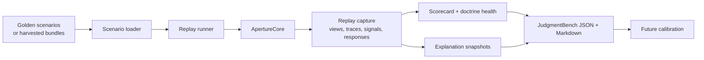

# Aperture Lab

Replay, scorecard, benchmark, and calibration scaffolding for Aperture.

This is the secondary research and evaluation surface, not the primary product
surface.

This package is the first implementation surface behind **Aperture Lab**.

The named discovery and calibration subsystem inside Aperture Lab is
**F-Stop**.

The canonical user-facing CLI surface for F-Stop is provider-neutral.

Normal operator commands:

- `pnpm lab:fstop:ingest ...`
- `pnpm lab:fstop:run ...`
- `pnpm lab:fstop:sweep ...`
- `pnpm lab:fstop:campaign ...`
- `pnpm lab:fstop:service ...`

Lower-level debugging commands:

- `pnpm lab:fstop:runner --provider <provider>`
- `pnpm lab:fstop:review ...`
- `pnpm lab:fstop:reviewer --provider <provider>`
- `pnpm lab:fstop:propose ...`
- `pnpm lab:fstop:optimize --provider <provider>`
- `pnpm lab:fstop:optimizer --provider <provider>`

Its job is to run deterministic scenarios against
[`@tomismeta/aperture-core`](https://www.npmjs.com/package/@tomismeta/aperture-core),
capture traces and signals, and turn the result into doctrine-shaped
evaluation output.

The first benchmark identity produced by this package should be
**JudgmentBench**.

## Napkin

```text
+----------------+    +-------------------+    +--------------------+    +------------------+
| Scenario or    | -> |   Replay runner   | -> |   ApertureCore     | -> | Trace, signals,  |
| session bundle |    |   applies steps   |    | deterministic      |    | views, responses |
+----------------+    +-------------------+    +--------------------+    +------------------+

fixture or            publish / submit         policy / value /          replay result
harvested data        and silent signals       planner / continuity      plus scorecard
```

## Architecture


```mermaid
flowchart LR
    A["Golden scenarios<br/>or harvested bundles"] --> B["Scenario loader"]
    B --> C["Replay runner"]
    C --> D["ApertureCore"]
    D --> E["Replay capture<br/>views, traces, signals, responses"]
    E --> F["Scorecard + doctrine health"]
    E --> G["Explanation snapshots"]
    F --> H["JudgmentBench JSON + Markdown"]
    G --> H
    H --> I["Future calibration"]
```

## What This Package Owns

- scenario schemas
- replay execution
- replay result capture
- scorecards for doctrine-shaped metrics

## What It Does Not Own

- live runtime hosting
- source adapters
- the TUI
- benchmark branding or leaderboard surfaces

Those remain elsewhere in the repo for now.

## Current Shape

Today this package provides:

- a deterministic replay scenario format
- a runner that applies steps against `ApertureCore`
- a replay result object with frames, view snapshots, traces, signals, and
  responses
- normalized event snapshots for `publishSource` steps, so harvested bundles can
  preserve both source-native and canonical event views
- semantic snapshots for `publishSource` steps, so the lab can test how core
  read a source event before the full judgment loop ran
- decision snapshots for publish steps, so the lab can test how ambiguity and
  semantic confidence affected routing
- trace-level expectations, so scenarios can assert ambiguity lifecycles like
  `next -> now` and `ambient -> now`
- a session-bundle format plus load/write helpers for local harvested replay
- a basic scorecard built on top of core trace evaluation and signal summaries
- a first golden-scenario set for `JudgmentBench`
- a benchmark runner that can write JSON results into `.aperture/lab/results`
- a runtime artifact footprint that stays under `.aperture/lab` and can be
  pruned with `pnpm clean:workspace`

The first semantic-robustness tranche now covers:

- dangerous approval wording without an explicit `riskHint`
- read-like approval wording that should stay low consequence
- adapter semantic overrides
- implied asks buried in status text
- dramatic status wording that should remain passive
- relation semantics for recurring and resolving issue wording
- bounded semantic ambiguity handling for:
  - low-confidence non-blocking work that should queue instead of interrupting
  - abstained non-blocking work that should stay peripheral
  - recovery paths where ambiguous work later activates once stronger evidence arrives
- adversarial wording such as:
  - negated approval language that should stay passive
  - production-context read wording that should not inflate consequence

There is also a deterministic perturbation layer on top of those scenarios:

- `pnpm judgment:fuzz`
- generates phrasing-shifted semantic variants
- pressure-tests the semantic layer without changing the canonical authored bench

The first harvested-reality layer is now also live:

- `canonicalAttentionExportToScenario(...)`
- `createSessionBundle(...)`
- `createSessionBundleFromCanonicalAttentionExport(...)`
- `createSessionBundleFromScenario(...)`
- `createSessionBundleFromRuntimeCapture(...)`
- `writeSessionBundle(...)`
- `loadSessionBundles(...)`
- `runSessionBundle(...)`
- runtime-side local captures via `exportSessionCapture()` or `GET /runtime/session`
- canonical host exports such as Paperclip's replay/export shapes

These helpers are designed for redacted, local-first replay bundles rather than
raw execution logs.

The fastest way to export a live runtime capture into a Lab bundle is:

```bash
pnpm session:export
```

This will discover the most recent local Aperture runtime, fetch its session
capture, convert that capture into a replay bundle, and write the bundle under
[packages/lab/bundles](https://github.com/tomismeta/aperture/tree/main/packages/lab/bundles).

To seed Lab with public benchmark trajectories, use:

```bash
pnpm trajectory:import --dataset swe-smith --limit 5
```

This imports public trajectories from
[`SWE-bench/SWE-smith-trajectories`](https://huggingface.co/datasets/SWE-bench/SWE-smith-trajectories),
first normalizes them into the Lab-owned canonical imported-session shape, then
maps them into `publishSource` replay steps, runs them through core, and writes
the resulting local bundles under `.aperture/lab/bundles/public`.
These imports are local seed material for Lab, not committed benchmark truth.

The same canonical import path now supports richer external session corpora too:

```bash
pnpm trajectory:import --dataset dataclaw --split train --limit 5
```

That path imports `woctordho/dataclaw`, normalizes each session into the shared
`ImportedSession` shape, then compiles deterministic replay bundles under
`.aperture/lab/bundles/public/dataclaw`.

To point F-Stop at a known raw export file directly, use:

```bash
pnpm lab:fstop:ingest --file /absolute/path/to/raw-export.jsonl --json
```

This writes replayable bundles under `.aperture/lab/bundles/raw` by default.
The raw-file ingest path currently accepts supported SWE-smith rows, DataClaw
rows, Pi-family rows/JSONL exports, OpenAgentSessions rows, and OpenAgentSessions JSONL event
logs.
It also writes canonical F-Stop Session files under `.aperture/lab/sessions`
so raw imports have one stable intermediate shape before replay.

The standard input file for F-Stop is a canonical F-Stop Session JSON:

- [docs/lab/fstop-session-format.md](/Users/tom/dev/aperture/docs/lab/fstop-session-format.md)
- [docs/lab/fstop-cheat-sheet.md](/Users/tom/dev/aperture/docs/lab/fstop-cheat-sheet.md)

That file can be handed directly to:

```bash
pnpm lab:fstop:run --provider <provider> --reviewer-provider <provider> --optimizer-provider <provider> --file /absolute/path/to/session.fstop-session.json --json
```

To prepare one imported bundle for offline AI review, use:

```bash
pnpm lab:fstop:prepare --bundle .aperture/lab/bundles/public/swe-smith/tool/<bundle>.json --json
```

This writes a structured review artifact under `.aperture/lab/results/offline-review/requests`.

To render a reviewer-model prompt from that artifact, use:

```bash
pnpm lab:fstop:prompt --artifact .aperture/lab/results/offline-review/requests/<bundle>.json --json
```

This writes a prompt under `.aperture/lab/results/offline-review/prompts`.

For unattended runs, let the Lab runner execute the reviewer command directly:

```bash
pnpm lab:fstop:review:run --artifact .aperture/lab/results/offline-review/requests/<bundle>.json --reviewer-command "pnpm lab:fstop:reviewer --provider <provider>" --json
```

This writes:

- a reviewer prompt under `.aperture/lab/results/offline-review/prompts`
- the raw reviewer stdout under `.aperture/lab/results/offline-review/raw`
- a completed review artifact under `.aperture/lab/results/offline-review/responses`
- a disagreement report under `.aperture/lab/results/offline-review/disagreements`
- a recommendation summary under `.aperture/lab/results/offline-review/recommendations`
- a run summary under `.aperture/lab/results/offline-review/runs`

If you already have a completed artifact and just want to recompute the
disagreement report, use:

```bash
pnpm lab:fstop:compare --artifact .aperture/lab/results/offline-review/responses/<bundle>.json --json
```

The stable reviewer adapter is:

```bash
pnpm lab:fstop:reviewer --provider <provider>
```

It resolves the actual provider command from environment variables instead of
hard-coding Hermes/OpenClaw invocation details into the main runner loop.
Both Hermes and OpenClaw now use the same repo-native harness wrapper by
default:

- prompt arrives on `stdin`
- provider-specific invocation runs underneath
- normalized structured output returns on `stdout`

Custom commands are still supported through
`APERTURE_HERMES_REVIEWER_COMMAND`, `APERTURE_HERMES_OPTIMIZER_COMMAND`,
`APERTURE_OPENCLAW_REVIEWER_COMMAND`, and
`APERTURE_OPENCLAW_OPTIMIZER_COMMAND`, but they are now overrides rather than
requirements. The built-in OpenClaw harness still uses a fresh session id per
review by default so unattended batches do not pile context into a shared
`main` session.

For a clean unattended batch on a remote box, use:

```bash
pnpm lab:fstop:campaign --provider openclaw --dataset dataclaw --split train --reviewer-provider openclaw --optimizer-provider openclaw --json
```

This runs multiple F-Stop windows from a clean source checkout, creates an
isolated git worktree per window with shared `node_modules`, and writes live
monitoring artifacts under
`.aperture/lab/campaigns/<campaign-id>`:

- `campaign.log`
- `status.json`
- `summary.jsonl`
- `current-run/`

The easiest live watch commands are:

```bash
tail -f .aperture/lab/current-campaign/campaign.log
cat .aperture/lab/current-campaign/status.json
tail -f .aperture/lab/current-campaign/current-run/run.log
```

```bash
pnpm lab:fstop:review --dataset swe-smith --split tool --limit 3 --reviewer-provider <provider> --json
```

This imports or selects bundles, prepares artifacts, runs the reviewer loop for
each one, and writes an aggregate batch report under
`.aperture/lab/results/offline-review/batches`.

For the highest-autonomy top-level run on the box, use:

```bash
pnpm lab:fstop:run --provider <provider> --reviewer-provider <provider> --optimizer-provider <provider> --json
```

This lets the provider-managed runner keep trying proposal slices until it
finds a reviewable proposal patch or exhausts the configured slice budget.

For a productized single-file unattended run, use:

```bash
pnpm lab:fstop:run --provider <provider> --reviewer-provider <provider> --optimizer-provider <provider> --file /absolute/path/to/bundle-or-batch.json --json
```

`--file` autodetects either:

- a replayable session bundle JSON
- a precomputed offline-review batch report JSON
- a canonical F-Stop Session JSON
- a supported raw export file, including raw Pi row JSON/JSONL, which is first
  ingested into local bundles

Gists are not required for this productized path. They are just one possible
publication format for public corpora like OpenAgentSessions; the unattended
F-Stop runtime operates on local files and local runtime state.

The preferred standard input is:

- a canonical `*.fstop-session.json` file

That file is the stable replay-oriented handoff shape for imported sessions.
Raw exports should normalize into that first, then into replay bundles.

In direct file mode, F-Stop runs one unattended proposal attempt, writes runtime
artifacts under `.aperture/lab/results`, and emits:

- proposal JSON and Markdown
- intent statements summarizing what should change
- code recommendations summarizing suggested files and optimizer rationale
- an optional patch diff when the optimizer leaves one behind

When a run ends `no_proposal`, F-Stop now still preserves the best retained
near-miss instead of dropping it into counts only. The main human-facing files
are:

- runner review: `.aperture/lab/results/autoresearch/runner/runs/<run>.md`
- retained proposal brief:
  `.aperture/lab/results/autoresearch/backlog/autoresearch-retained-backlog.md`

The runner Markdown keeps the best single-run retained intent under:

- `Retained Intent`
- `Intent Statements`
- `Code Recommendations`
- `Retained Attempts`

The backlog Markdown compiles repeated retained proposals across runs into one
plain-English review brief with:

- observed pattern
- proposed change
- example evidence
- latest optimizer result
- artifact paths for follow-up

For a long-running supervised VPS process with restart and stall handling, use:

```bash
pnpm lab:fstop:service --provider <provider> --reviewer-provider <provider> --optimizer-provider <provider> --json
```

This wraps one-window campaign runs, restarts on failure or stalls, and keeps a
stable service status under `.aperture/lab/service/status.json`.

For the shortest default commands on the box, use either:

```bash
pnpm lab:fstop:openclaw
```

or:

```bash
pnpm lab:fstop:hermes
```

The OpenClaw shortcut expands to:

- provider: `openclaw`
- reviewer provider: `openclaw`
- optimizer provider: `openclaw`
- uses the top-level `lab:fstop:run` entrypoint

The Hermes shortcut expands to:

- provider: `hermes`
- reviewer provider: `hermes`
- optimizer provider: `hermes`
- uses the top-level `lab:fstop:run` entrypoint

To let the box run all the way through a reviewable code proposal, use:

```bash
pnpm lab:fstop:propose --reviewer-provider <provider> --optimizer-provider <provider> --json
```

This command:

- runs a discovery batch
- keeps partial results if one reviewer reply is malformed
- clusters repeated high-confidence disagreements
- promotes those into an ignored candidate calibration corpus
- runs the optimizer against the committed corpus plus the candidate corpus
- writes a proposal artifact under `.aperture/lab/results/autoresearch/proposals`
- writes an optional patch artifact if the optimizer actually improves the score

Every campaign window also keeps a stable synthesized final report pointer:

- `.aperture/lab/current-campaign/current-report.json`
- `.aperture/lab/current-campaign/current-report.md`

These point at a human- and machine-readable F-Stop report that summarizes:

- run coverage and counts
- major disagreements
- intent statements
- code recommendations
- optimizer and gate outcomes
- selected patch artifacts when present

To turn reviewer disagreements into a repeatable optimization surface, promote
selected reports into the frozen calibration corpus:

```bash
pnpm lab:fstop:promote --report .aperture/lab/results/offline-review/disagreements/<bundle>.json --split train --json
```

This writes a calibration case under `packages/lab/calibration/<split>` with:

- corrected expectations from promoted disagreements
- limited same-step invariants so nearby classifications stay stable
- suggested remediation targets

To score the current semantic/importer layer against that frozen corpus, use:

```bash
pnpm lab:fstop:evaluate --json
```

To generate the runner-facing optimization brief for the VPS, use:

```bash
pnpm lab:fstop:cycle --json
```

This writes:

- evaluation reports under `.aperture/lab/results/autoresearch/evaluations`
- optimization briefs under `.aperture/lab/results/autoresearch/briefs`

This is the quiet half of the autoresearch loop: reviewer batches discover new
cases, but calibration reports are the repeatable score surface that bounded
semantic-layer patches should optimize against.

To prune old runtime churn and keep the VPS footprint quiet, use:

```bash
pnpm lab:fstop:gc --json
```

This keeps recent campaigns and recent result artifacts while removing stale
runtime output under `.aperture/lab`. It also prunes stale git worktree
metadata so old campaign windows do not leave extra bookkeeping behind.

To let the VPS OpenClaw or Hermes worker make the bounded code changes itself,
use:

```bash
pnpm lab:fstop:optimize --provider <provider> --json
```

This command:

- requires a clean worktree before it starts
- regenerates the frozen calibration report and optimization brief
- renders the optimizer prompt
- runs the configured optimizer provider
- verifies that only the allowed edit surface changed
- reruns the calibration evaluation plus judgment/release gates
- writes optimizer artifacts under `.aperture/lab/results/autoresearch/optimizer`

The stable optimizer adapter is:

```bash
pnpm lab:fstop:optimizer --provider <provider>
```

The stable runner adapter is:

```bash
pnpm lab:fstop:runner --provider <provider>
```

For the shortest default VPS commands, use:

```bash
pnpm lab:fstop:openclaw
pnpm lab:fstop:hermes
```

For cleaner real-session collection, use:

```bash
pnpm session:record
```

This records from the current runtime capture as a baseline, waits while you
exercise the system, and exports only the new session slice when you press
Enter.

To promote a raw bundle into a durable replay scenario, use:

```bash
pnpm session:promote --bundle packages/lab/bundles/<bundle>.json --collection wild --delete-source
```

This converts the raw capture into a replay scenario under
[packages/lab/harvested](https://github.com/tomismeta/aperture/tree/main/packages/lab/harvested), carries
source provenance and capture metadata forward, and can delete the raw bundle
once it has been distilled.

The intended split is:

- [packages/lab/bundles](https://github.com/tomismeta/aperture/tree/main/packages/lab/bundles)
  - temporary local-first raw captures
  - local imported public-seed bundles under `.aperture/lab/bundles/public`
- [packages/lab/harvested](https://github.com/tomismeta/aperture/tree/main/packages/lab/harvested)
  - kept replay scenarios from real sessions, including "wild capture" probes
- [packages/lab/golden](https://github.com/tomismeta/aperture/tree/main/packages/lab/golden)
  - curated doctrine fixtures that should stay stable enough for JudgmentBench

## Status

- good enough to start collecting golden scenarios
- intentionally in-repo while the trace and corpus shapes mature
- not yet a public benchmark repo

## How To Read This Package

Read this package as supporting infrastructure for the main engine and product
docs, not as a second product.

The current source-of-truth stack is:

- [Docs Home](../../docs/README.md)
- [Engine Status Pillars](../../docs/engine/engine-status-pillars.md)
- [Core Engine Audit (2026-03)](../../docs/engine/core-engine-audit-2026-03.md)
- [Roadmaps Index](../../docs/roadmap/README.md)

For the broader lab architecture and naming ontology, see
[Aperture Lab](../../docs/lab/aperture-lab.md).

For the cleaner target shape of the F-Stop runtime, see
[F-Stop Architecture](../../docs/lab/fstop-architecture.md).

For a short glossary of the most common F-Stop terms, see
[F-Stop Cheat Sheet](../../docs/lab/fstop-cheat-sheet.md).

For the concrete harvesting and labeling plan behind JudgmentBench, see
[JudgmentBench Data Strategy](../../docs/lab/judgmentbench-data-strategy.md).

For the first five real-session collection targets, see
[Harvested Session Collection Runbook](../../docs/lab/harvested-session-collection-runbook.md).
