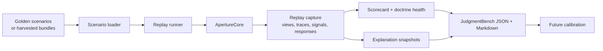

# Aperture Lab

Replay, scorecard, benchmark, and calibration scaffolding for Aperture.

This is the secondary research and evaluation surface, not the primary product
surface.

This package is the first implementation surface behind **Aperture Lab**.

Its job is to run deterministic scenarios against
[`@tomismeta/aperture-core`](https://www.npmjs.com/package/@tomismeta/aperture-core),
capture traces and signals, and turn the result into doctrine-shaped
evaluation output.

The first benchmark identity produced by this package should be
**JudgmentBench**.

## Napkin

```text
+----------------+    +-------------------+    +--------------------+    +------------------+
| Scenario or    | -> |   Replay runner   | -> |   ApertureCore     | -> | Trace, signals,  |
| session bundle |    |   applies steps   |    | deterministic      |    | views, responses |
+----------------+    +-------------------+    +--------------------+    +------------------+

fixture or            publish / submit         policy / value /          replay result
harvested data        and silent signals       planner / continuity      plus scorecard
```

## Architecture


```mermaid
flowchart LR
    A["Golden scenarios<br/>or harvested bundles"] --> B["Scenario loader"]
    B --> C["Replay runner"]
    C --> D["ApertureCore"]
    D --> E["Replay capture<br/>views, traces, signals, responses"]
    E --> F["Scorecard + doctrine health"]
    E --> G["Explanation snapshots"]
    F --> H["JudgmentBench JSON + Markdown"]
    G --> H
    H --> I["Future calibration"]
```

## What This Package Owns

- scenario schemas
- replay execution
- replay result capture
- scorecards for doctrine-shaped metrics

## What It Does Not Own

- live runtime hosting
- source adapters
- the TUI
- benchmark branding or leaderboard surfaces

Those remain elsewhere in the repo for now.

## Current Shape

Today this package provides:

- a deterministic replay scenario format
- a runner that applies steps against `ApertureCore`
- a replay result object with frames, view snapshots, traces, signals, and
  responses
- normalized event snapshots for `publishSource` steps, so harvested bundles can
  preserve both source-native and canonical event views
- semantic snapshots for `publishSource` steps, so the lab can test how core
  read a source event before the full judgment loop ran
- decision snapshots for publish steps, so the lab can test how ambiguity and
  semantic confidence affected routing
- trace-level expectations, so scenarios can assert ambiguity lifecycles like
  `queue -> active` and `ambient -> active`
- a session-bundle format plus load/write helpers for local harvested replay
- a basic scorecard built on top of core trace evaluation and signal summaries
- a first golden-scenario set for `JudgmentBench`
- a benchmark runner that can write JSON results into
  [packages/lab/results](https://github.com/tomismeta/aperture/tree/main/packages/lab/results)

The first semantic-robustness tranche now covers:

- dangerous approval wording without an explicit `riskHint`
- read-like approval wording that should stay low consequence
- adapter semantic overrides
- implied asks buried in status text
- dramatic status wording that should remain passive
- relation semantics for recurring and resolving issue wording
- bounded semantic ambiguity handling for:
  - low-confidence non-blocking work that should queue instead of interrupting
  - abstained non-blocking work that should stay peripheral
  - recovery paths where ambiguous work later activates once stronger evidence arrives
- adversarial wording such as:
  - negated approval language that should stay passive
  - production-context read wording that should not inflate consequence

There is also a deterministic perturbation layer on top of those scenarios:

- `pnpm judgment:fuzz`
- generates phrasing-shifted semantic variants
- pressure-tests the semantic layer without changing the canonical authored bench

The first harvested-reality layer is now also live:

- `canonicalAttentionExportToScenario(...)`
- `createSessionBundle(...)`
- `createSessionBundleFromCanonicalAttentionExport(...)`
- `createSessionBundleFromScenario(...)`
- `createSessionBundleFromRuntimeCapture(...)`
- `writeSessionBundle(...)`
- `loadSessionBundles(...)`
- `runSessionBundle(...)`
- runtime-side local captures via `exportSessionCapture()` or `GET /runtime/session`
- canonical host exports such as Paperclip's replay/export shapes

These helpers are designed for redacted, local-first replay bundles rather than
raw execution logs.

The fastest way to export a live runtime capture into a Lab bundle is:

```bash
pnpm session:export
```

This will discover the most recent local Aperture runtime, fetch its session
capture, convert that capture into a replay bundle, and write the bundle under
[packages/lab/bundles](https://github.com/tomismeta/aperture/tree/main/packages/lab/bundles).

To seed Lab with public benchmark trajectories, use:

```bash
pnpm trajectory:import --dataset swe-smith --limit 5
```

This imports public trajectories from
[`SWE-bench/SWE-smith-trajectories`](https://huggingface.co/datasets/SWE-bench/SWE-smith-trajectories),
maps them into `publishSource` replay steps, runs them through core, and writes
the resulting local bundles under `packages/lab/bundles/public`.
These imports are local seed material for Lab, not committed benchmark truth.

To prepare one imported bundle for offline AI review, use:

```bash
pnpm lab:review:prepare --bundle packages/lab/bundles/public/swe-smith/tool/<bundle>.json --json
```

This writes a structured review artifact under `packages/lab/results/offline-review/requests`.

To render a reviewer-model prompt from that artifact, use:

```bash
pnpm lab:review:prompt --artifact packages/lab/results/offline-review/requests/<bundle>.json --json
```

This writes a prompt under `packages/lab/results/offline-review/prompts`.

For unattended runs, let the Lab runner execute the reviewer command directly:

```bash
pnpm lab:review:run --artifact packages/lab/results/offline-review/requests/<bundle>.json --reviewer-command "pnpm lab:review:reviewer --provider <provider>" --json
```

This writes:

- a reviewer prompt under `packages/lab/results/offline-review/prompts`
- the raw reviewer stdout under `packages/lab/results/offline-review/raw`
- a completed review artifact under `packages/lab/results/offline-review/responses`
- a disagreement report under `packages/lab/results/offline-review/disagreements`
- a recommendation summary under `packages/lab/results/offline-review/recommendations`
- a run summary under `packages/lab/results/offline-review/runs`
- a TSV run log under `packages/lab/results/offline-review/results.tsv`

If you already have a completed artifact and just want to recompute the
disagreement report, use:

```bash
pnpm lab:review:compare --artifact packages/lab/results/offline-review/responses/<bundle>.json --json
```

The stable reviewer adapter is:

```bash
pnpm lab:review:reviewer --provider <provider>
```

It resolves the actual provider command from environment variables instead of
hard-coding Hermes/OpenClaw invocation details into the main runner loop.
For OpenClaw, the adapter can also invoke the local `openclaw` binary directly
when it is available on `PATH`, so the VPS runner does not need a custom shell
wrapper just to extract the reviewer payload. It uses a fresh OpenClaw session
id per review by default so batch runs do not pile context into the shared
`main` session.

For a clean unattended batch on a remote box, use:

```bash
pnpm lab:review:batch --dataset swe-smith --split tool --limit 3 --reviewer-provider openclaw --json
```

This imports or selects bundles, prepares artifacts, runs the reviewer loop for
each one, and writes an aggregate batch report under
`packages/lab/results/offline-review/batches`.

For the shortest default command on the box, use:

```bash
pnpm lab:review:openclaw
```

That currently expands to:

- dataset: `swe-smith`
- split: `tool`
- limit: `2`
- reviewer provider: `openclaw`

To turn reviewer disagreements into a repeatable optimization surface, promote
selected reports into the frozen calibration corpus:

```bash
pnpm lab:autoresearch:promote --report packages/lab/results/offline-review/disagreements/<bundle>.json --split train --json
```

This writes a calibration case under `packages/lab/calibration/<split>` with:

- corrected expectations from promoted disagreements
- limited same-step invariants so nearby classifications stay stable
- suggested remediation targets

To score the current semantic/importer layer against that frozen corpus, use:

```bash
pnpm lab:autoresearch:evaluate --json
```

To generate the runner-facing optimization brief for the VPS, use:

```bash
pnpm lab:autoresearch:cycle --json
```

This writes:

- evaluation reports under `packages/lab/results/autoresearch/evaluations`
- optimization briefs under `packages/lab/results/autoresearch/briefs`

This is the quiet half of the autoresearch loop: reviewer batches discover new
cases, but calibration reports are the repeatable score surface that bounded
semantic-layer patches should optimize against.

To let the VPS OpenClaw or Hermes worker make the bounded code changes itself,
use:

```bash
pnpm lab:autoresearch:optimize --provider openclaw --json
```

This command:

- requires a clean worktree before it starts
- regenerates the frozen calibration report and optimization brief
- renders the optimizer prompt
- runs the configured optimizer provider
- verifies that only the allowed edit surface changed
- reruns the calibration evaluation plus judgment/release gates
- writes optimizer artifacts under `packages/lab/results/autoresearch/optimizer`

The stable optimizer adapter is:

```bash
pnpm lab:autoresearch:optimizer --provider <provider>
```

For the shortest default VPS command, use:

```bash
pnpm lab:autoresearch:openclaw
```

For cleaner real-session collection, use:

```bash
pnpm session:record
```

This records from the current runtime capture as a baseline, waits while you
exercise the system, and exports only the new session slice when you press
Enter.

To promote a raw bundle into a durable replay scenario, use:

```bash
pnpm session:promote --bundle packages/lab/bundles/<bundle>.json --collection wild --delete-source
```

This converts the raw capture into a replay scenario under
[packages/lab/harvested](https://github.com/tomismeta/aperture/tree/main/packages/lab/harvested), carries
source provenance and capture metadata forward, and can delete the raw bundle
once it has been distilled.

The intended split is:

- [packages/lab/bundles](https://github.com/tomismeta/aperture/tree/main/packages/lab/bundles)
  - temporary local-first raw captures
  - local imported public-seed bundles under `packages/lab/bundles/public`
- [packages/lab/harvested](https://github.com/tomismeta/aperture/tree/main/packages/lab/harvested)
  - kept replay scenarios from real sessions, including "wild capture" probes
- [packages/lab/golden](https://github.com/tomismeta/aperture/tree/main/packages/lab/golden)
  - curated doctrine fixtures that should stay stable enough for JudgmentBench

## Status

- good enough to start collecting golden scenarios
- intentionally in-repo while the trace and corpus shapes mature
- not yet a public benchmark repo

## How To Read This Package

Read this package as supporting infrastructure for the main engine and product
docs, not as a second product.

The current source-of-truth stack is:

- [Docs Home](../../docs/README.md)
- [Engine Status Pillars](../../docs/engine/engine-status-pillars.md)
- [Core Engine Audit (2026-03)](../../docs/engine/core-engine-audit-2026-03.md)
- [Roadmaps Index](../../docs/roadmap/README.md)

For the broader lab architecture and naming ontology, see
[Aperture Lab](../../docs/lab/aperture-lab.md).

For the concrete harvesting and labeling plan behind JudgmentBench, see
[JudgmentBench Data Strategy](../../docs/lab/judgmentbench-data-strategy.md).

For the first five real-session collection targets, see
[Harvested Session Collection Runbook](../../docs/lab/harvested-session-collection-runbook.md).
